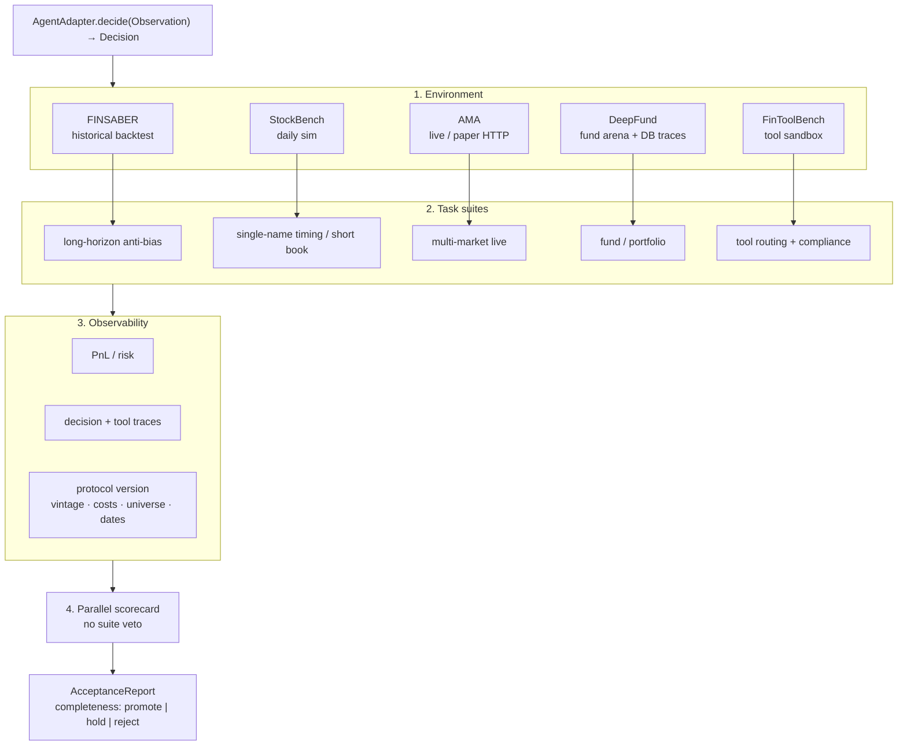
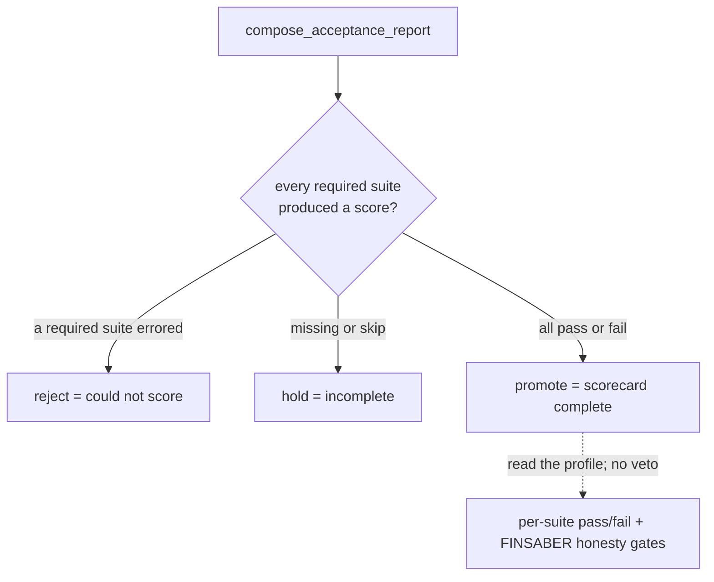

# Architecture

This repo is a **composition layer**. Each upstream module stays the source of truth for its engine, metrics, and artifacts. We add four things they do not share:

1. A single `AgentAdapter` so one agent can sit every exam.
2. A versioned **protocol** (the exam paper) with a stable hash.
3. A unified `SuiteResult` harvested from official outputs.
4. A **parallel scorecard** (`AcceptanceReport`) that profiles every suite; no suite vetoes another.

We do not replace StockBench's backtest, AMA's HTTP testbed, DeepFund's graph, FinToolBench's evaluator, or FINSABER's fill model.

## Four layers



| Layer | What it is | Who owns the implementation |
| --- | --- | --- |
| Environment | The world the agent may touch | Upstream engines, wrapped by `EnvAdapter` |
| Task suite | The question we ask | Mapping in this repo (`suite_id`) |
| Observability | Evidence we keep | Harvest of official artifacts + protocol hash |
| Parallel scorecard | Per-suite profile | `evaluate_admission()` summarizes completeness only; FINSABER honesty is a suite metric |

No suite silently overrides another. FINSABER fail does **not** veto AMA / StockBench / FinTool / DeepFund.

## Suite ids

| `suite_id` | Environment | Task suite | Scorecard role |
| --- | --- | --- | --- |
| `finsaber.long_horizon` | historical backtest | long-horizon anti-bias | **v1 required** (honesty gates on this suite) |
| `stockbench.daily_sim` | daily sim | single-name / short-horizon book | **v1 required** |
| `ama.multi_market_live` | live / paper HTTP | crypto + US names, daily | **v1 required** |
| `deepfund.fund_arena` | live / paper graph | fund / portfolio + traces | **v1 required** |
| `fintoolbench.tool_compliance` | tool sandbox | routing + TMR/IMR/DMR | **v1 required** |
| `investorbench.decision` | cross-asset decision env | stock / crypto / ETF | v2 optional until a full protocol run |
| `livetradebench.live` | live stocks + Polymarket | 50-day live allocation | v2 optional until a full protocol run |
| `finmcp.tool_mcp` | MCP tool servers | tool F1 / EMR | v2 optional until a full protocol run |
| `vals_finance_agent.research` | SEC + web tools | expert research accuracy | v2 optional until a full protocol run |
| `finsearchcomp.search` | open-domain search | time-sensitive + historical | v2 optional until a full protocol run |
| `openpm.portfolio_pit` | PIT S&P 500 5m panel | portfolio + contamination cert | v2 optional until a full protocol run |

`REQUIRED_SUITE_IDS_V1` vs `PLANNED_SUITE_IDS_V2` live in `adapters/base.py`. Promote today is the v1 five.

## One AgentAdapter, many suites

**Ideal:** every `EnvAdapter` translates native cadence onto `AgentAdapter.decide(observation)` and harvests a `SuiteResult`. The agent never imports FINSABER or AMA.

**Reality (do not pretend LCD `decide()` is universal yet):**

| Suite | Uses `decide()`? | What actually runs |
| --- | --- | --- |
| FINSABER | yes | `BaseStrategyIso.on_data` → `agent.decide` → `framework.buy/sell` |
| AMA | yes | `AmaHttpShim` / `POST /trading_action/` → `agent.decide` |
| FinToolBench | yes | Grok tool-use loop emits JSONL from `decide()`, then official evaluator |
| StockBench | **no** | official CLI + YAML overlay; `run()` does `_ = agent` |
| DeepFund | **no** | official `main.py --local-db` + Grok YAML; `run()` does `_ = agent` |

Known patches and harvest gaps: [`docs/engineering/GLUE.md`](docs/engineering/GLUE.md).

```mermaid
sequenceDiagram
  participant A as AgentAdapter
  participant SB as StockBenchEnv
  participant AMA as AmaEnv HTTP shim
  participant DF as DeepFundEnv
  participant FT as FinToolBenchEnv
  participant FS as FinsaberEnv
  participant G as Parallel scorecard

  Note over A,G: ideal LCD is decide(); StockBench/DeepFund are CLI bridges
  SB->>SB: official CLI / YAML (`_ = agent`)
  AMA->>A: POST /trading_action body
  A-->>AMA: BUY/SELL/HOLD + reasoning
  DF->>DF: official main.py --local-db (`_ = agent`)
  FT->>A: question + tool cards
  A-->>FT: tool_calls JSONL
  FS->>A: date-t bar (next_open fill)
  A-->>FS: buy/sell via BaseStrategyIso
  SB->>G: SuiteResult skip/pass
  AMA->>G: SuiteResult
  DF->>G: SuiteResult
  FT->>G: SuiteResult
  FS->>G: SuiteResult + honesty gates (suite metrics)
  G-->>G: completeness promote / hold / reject
```

Native shapes differ; the adapter contract is the lowest common denominator. It is **AMA-shaped** (`BUY`/`SELL`/`HOLD` plus optional allocations and tool_calls), not a native OpenClaw/Hermes turn and not a StockBench `on_bar`. Runtime harnesses (OpenClaw `AgentHarnessV2`, Hermes `AIAgent`) are backends for an `AgentAdapter` implementation. They are not exam rooms. Each `EnvAdapter` must translate onto that module’s official surface (HTTP, `BaseStrategyIso.on_data`, official CLI, or result JSONL) — or document that it is a CLI/YAML bridge. See [`docs/research/IMPLICATIONS_FOR_ARCHITECTURE.md`](docs/research/IMPLICATIONS_FOR_ARCHITECTURE.md).

The LCD maps as follows:

| Upstream native object | Maps from `Observation` | Maps onto `Decision` |
| --- | --- | --- |
| StockBench bar + dual-agent prompts | prices, news, portfolio | `action` / `allocations` |
| AMA `POST /trading_action/` | date, price, news, 10k/10q | `recommended_action`, `reasoning` |
| DeepFund analyst / PM | tickers, cash, signals | `action`, shares, justification |
| FinToolBench question row | `query`, tool manifest | `tool_calls`, final answer |
| FINSABER `on_data(date, today_data, framework)` | price/news/filings at t | `framework.buy` / `sell` |

Prefer **subprocess of the official CLI** (or HTTP to AMA) over rewriting engines. In-process wrapping is allowed only at the strategy / endpoint boundary (e.g. `AmaHttpShim`, a `BaseStrategyIso` that calls `decide`). StockBench and DeepFund currently skip that boundary and shell out to official CLI/YAML; do not document them as `decide()` loops until they are.

## Adapter contracts

Defined in `adapters/base.py` (stdlib only).

```
AgentAdapter
  agent_id: str
  capabilities() -> set[str]     # empty = willing to sit every suite
  decide(observation) -> Decision

EnvAdapter
  suite_id: str
  module_dir: str
  describe() -> mapping          # wrap plan, CLI, pitfalls
  run(agent, protocol) -> SuiteResult
```

`ProtocolSpec` is the exam paper:

- `suite_id`, `date_from` / `date_to`, `universe`
- `data_vintage` (dataset snapshot or tool-manifest fingerprint)
- `costs` (commission, slippage, liquidity, LLM cost flags)
- `execution_timing` (`next_open` vs `same_close`)
- `extra` (llm profile, config path, …)

`canonical_protocol_hash(protocol)` is `sha256:` of canonical JSON. A report-level `protocol_hash` hashes the list of per-suite hashes. **Answers are not in the hash.** Changing costs or vintage is a different exam even if Sharpe is identical.

Doctor / dry runs: `EnvAdapter.run` returns `status="skip"` unless `protocol.extra.execute` is true. `compose_acceptance_report` then yields `admission.decision = hold` (scorecard incomplete). Executed runs write per-suite pass/fail/error; completeness `promote` means every required suite produced a score, not that FINSABER honesty passed.

## Observability

Each suite already emits artifacts. We harvest; we do not invent a second ledger.

| Suite | PnL / risk | Traces | Protocol pins |
| --- | --- | --- | --- |
| FINSABER | `metrics.json`, `equity_curve.csv` | `trades.csv`, `orders.csv`, `llm_costs.csv` | `run_config.json` (timing, costs, universe) |
| StockBench | `storage/reports/backtest/` (cum_return, Sortino, MDD) | detailed trade JSON when enabled | `config.yaml` + `--start/--end/--llm-profile` |
| AMA | `get_return.py` table | `action/*_trading_decisions.json` | as-of date, news file, agent URL |
| DeepFund | `portfolio.total_assets` over `trading_date` | `decision`, `signal` tables | `exp_name`, YAML, `--local-db`, chronological dates |
| FinToolBench | n/a (not a PnL suite) | result JSONL `tool_calls` | eval date + `tools_all_annotated.jsonl` hash |

Artifact paths land on `SuiteResult.artifacts[]` with a `kind` (`metrics_json`, `equity_curve`, `tool_trace`, `decision_db`, `run_config`).

## Parallel scorecard



FINSABER honesty gates (see `adapters/finsaber.py`) stay **on that suite**:

1. `execution_timing == next_open` unless the protocol *declares* same-close.
2. Costs on: commission, slippage, liquidity cap.
3. Universe is not a `cherry_pick_*` setup.

They do not veto AMA / StockBench / FinTool / DeepFund. Sharpe vs buy-and-hold is a FINSABER performance metric, not a global gate.

Top-level `admission.decision` is completeness only:

| Decision | Meaning |
| --- | --- |
| `promote` | Every required suite produced a score (pass **or** fail). Read per-suite rows. |
| `hold` | A required suite is missing or skipped. |
| `reject` | A required suite errored (engine/data/API could not score it). |

## Report schema

`ACCEPTANCE_REPORT.schema.json` is the contract. Shape:

```json
{
  "schema_version": "1.0.0",
  "report_id": "uuid",
  "generated_at": "2026-09-12T00:00:00+00:00",
  "agent": { "agent_id": "my-agent", "version": "0.1" },
  "protocol_hash": "sha256:...",
  "suites": [
    {
      "suite_id": "finsaber.long_horizon",
      "status": "skip",
      "protocol": {
        "suite_id": "finsaber.long_horizon",
        "date_from": "2010-01-01",
        "date_to": "2024-12-31",
        "universe": ["AAPL"],
        "data_vintage": "FINSABER-V2-Data",
        "execution_timing": "next_open",
        "costs": { "slippage_perc": 0.0005, "liquidity_cap_pct": 0.025 }
      },
      "metrics": [],
      "gates": [],
      "artifacts": [{ "kind": "metrics_json", "path": "..." }],
      "upstream_cli": "FINSABERBt(config).run_iterative_tickers(...)"
    }
  ],
  "admission": {
    "decision": "hold",
    "kernel": "parallel_scorecard",
    "required_suites": [
      "ama.multi_market_live",
      "finsaber.long_horizon",
      "stockbench.daily_sim",
      "fintoolbench.tool_compliance",
      "deepfund.fund_arena"
    ],
    "optional_suites": [],
    "rationale": "scorecard incomplete: required suite(s) not yet run: ..."
  },
  "signatures": [
    { "role": "reviewer", "signer": "alice", "digest": "sha256:...", "signature": null }
  ]
}
```

Signatures are **slots**. This scaffold does not pick a crypto suite; a later step can sign the canonical JSON of the report body excluding `signatures`.

## Compose, don't rewrite

| Do | Don't |
| --- | --- |
| Shell out to `scripts/run_benchmark.sh`, `get_action.sh`, `main.py`, `run_relative_eval.py` | Reimplement fills, judges, or LangGraph |
| Wrap `decide()` at the strategy / HTTP boundary | Fork prompts into this repo |
| Harvest `metrics.json` / `all_metrics.json` / DB rows | Invent a second Sharpe |
| Pin protocol fields that upstream already writes (`run_config.json`) | Claim bitwise paper reproduction |

Module-level wrap plans live as docstrings in `adapters/{stockbench,ama,deepfund,fintoolbench,finsaber}.py`.

v2 layout: `adapters/v2_runtime.py` is the shared subprocess / xAI / skip / patch helper. Each v2 `EnvAdapter` stays protocol → official CLI → `SuiteResult`. Harvest, resume, and upstream patches for FinSearchComp / Vals / LiveTradeBench live in `adapters/v2_ops/`. Operator CLI: `scripts/v2_suite_ops.py` (`progress|harvest|resume`). Main eval entry remains `scripts/run_grok_cli_eval.py`.

How OpenClaw, Hermes, and each `modules/*` native surface map onto this LCD: [`docs/research/AGENT_PLUG_IN_SURVEY.md`](docs/research/AGENT_PLUG_IN_SURVEY.md), [`docs/research/PLUG_IN_MATRIX.md`](docs/research/PLUG_IN_MATRIX.md).

## FinAgentSandbox registries (pointer)

The four-layer story above is unchanged. A Harbor-style registration layer lives in `sandbox/` so a second harness, bench, or MCP plugin is a `_MAP` entry rather than a new eval loop. Product name: **FinAgentSandbox**.

Interface sketches: [`docs/paper/SANDBOX_REPO_DESIGN.md`](docs/paper/SANDBOX_REPO_DESIGN.md). Harbor norms: [`docs/paper/HARBOR_NORMS.md`](docs/paper/HARBOR_NORMS.md). Order: [`docs/paper/MIGRATION_PLAN.md`](docs/paper/MIGRATION_PLAN.md) (Phase B = GrokCliHarness + run_suites; Phase C = BenchFactory wrap).

| Registry | Today |
| --- | --- |
| `HarnessFactory` | `grok-cli` → `GrokCliHarness` only |
| `BenchFactory` | 11 `ALL_SUITE_IDS` → `EnvAdapterAsBench` wrap |
| `PluginFactory` | `mcp` → `McpPlugin` (FinMCP `plugin_env`) |

Eval runs through `sandbox.runtime.run_suites` (`scripts/run_eval.py --harness grok-cli`; `scripts/run_grok_cli_eval.py` is a thin alias). New dumps go under `artifacts/suite_results/<harness>/`. Scorecards and legacy flat `artifacts/suite_results/*.json` are not rewritten here.
