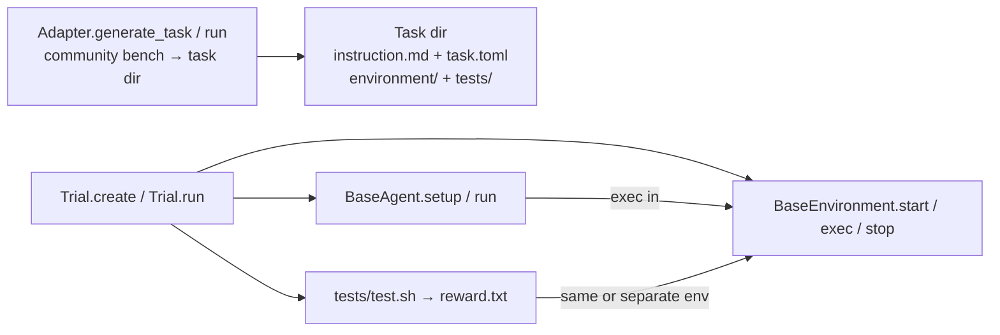

# Harbor norms (from source, not marketing)

| Field | Value |
| --- | --- |
| Title | Harbor ownership, registration, adapters, MCP/skills, parity |
| Author | Grok (design-doc-writer) |
| Date | 2026-09-16 |
| Status | Draft |
| Harbor clone | `/workspace/refs/harbor` (`harbor-framework/harbor`) |

This note records **what the Harbor code actually does**. Symbols and paths below were opened in this pass. If a name is not in a file we opened, we do not claim it exists.

**Harbor does not define `run_official`.** Adapters generate Harbor *tasks*; the official-CLI compose path is our product term, not a Harbor API.

---

## 1. Ownership boundaries

Harbor splits four concerns. `AGENTS.md` (Harbor root) states the invariant explicitly: *maintain a separation of concern between agents, tasks, and jobs* and *between trials and sandboxes*.



### 1.1 `BaseAgent` — the harness that runs *inside* a sandbox

File: `/workspace/refs/harbor/src/harbor/agents/base.py`  
Class: `BaseAgent`

The agent is **not** the exam paper and **not** the container. It is the installed harness (Claude Code, Codex, Grok Build, OpenClaw, …) that receives an instruction and drives a loop *in* an environment.

Constructor (`BaseAgent.__init__`) takes:

- `logs_dir: Path`
- `model_name: str | None`
- `mcp_servers: list[MCPServerConfig] | None` — “MCP servers from task config; see setup()/run() for usage”
- `skills_dir: str | None` — “Skills directory path in the environment”
- `extra_env`, `load_trajectory`, `environment_logs_dir`

Abstract surface (quoted method names):

| Method | Role |
| --- | --- |
| `name() -> str` | Static identifier (`@staticmethod`, `@abstractmethod`) |
| `version(self) -> str \| None` | Installed version |
| `async setup(self, environment: BaseEnvironment)` | Install tools; **register MCP** and **copy skills** |
| `async run(self, instruction, environment, context)` | Execute the task; populate `AgentContext` as it runs |
| `resume` / `load` / `handoff` | Optional; default `NotImplementedError` |
| `populate_context_post_run` | Optional backfill after host syncs logs |

`setup` docstring (opened, not paraphrased from memory):

> This is a good place to register the MCP servers in `self.mcp_servers` with the agent (e.g. by creating a .mcp.json file) and copy skills from `self.skills_dir` to the agent's expected location.

`run` repeats the same MCP/skills reminder and notes that `environment.default_user` is set by the orchestrator; `environment.exec` without an explicit `user` runs as that user.

Capabilities live on `AgentCapabilities` (`/workspace/refs/harbor/src/harbor/agents/capabilities.py`): `atif`, `resume`, `load_native_trajectory`, `load_atif_trajectory`, `handoff`, `native_config`, `windows`, `skills`, `mcp_servers`, `bridges`. Installed agents declare them, e.g. Harbor’s Grok Build:

```243:243:/workspace/refs/harbor/src/harbor/agents/installed/grok_build.py
    capabilities = AgentCapabilities(atif=True, skills=True, mcp_servers=True)
```

Installed-agent lifecycle is `BaseInstalledAgent.setup` → abstract `install` (`/workspace/refs/harbor/src/harbor/agents/installed/base.py` around L1040–L1049). `setup` mkdirs `/installed-agent`, calls `install`, then best-effort version detection.

### 1.2 `BaseEnvironment` — the sandbox *provider*, not a market plugin

File: `/workspace/refs/harbor/src/harbor/environments/base.py`  
Class: `BaseEnvironment`

Docstring: *“The containerized environment the agent interacts with. Consists of 1+ container(s). Examples of types of environments: Docker, Apptainer, Containerd, Podman.”*

This is a **compute/isolation provider**. It is **not** a Yahoo feed, an EDGAR tool, or an MCP server. Those are injected *into* the environment (task files, `MCPServerConfig`, skills).

Identity:

- `session_id` — ephemeral handle, e.g. `hello-world__bZZeEkw__env`
- `context_id` — durable UUID shared with the agent (trial id)

Abstract methods we opened:

| Method | Role |
| --- | --- |
| `type() -> str` | Provider id (built-ins return `EnvironmentType` members; third parties may return arbitrary strings) |
| `_validate_definition()` | Dockerfile / compose present |
| `async start(force_build)` | Provision |
| `async stop(delete)` | Tear down |
| `async upload_file` / `upload_dir` | Host → sandbox |
| `async download_file` / `download_dir` | Sandbox → host |
| `async exec(command, cwd, env, timeout_sec, user)` | Run a command; returns `ExecResult(stdout, stderr, return_code)` |

Supporting surface (not abstract, but part of the contract): `ensure_dirs`, `empty_dirs`, `reset_dirs`, `set_network_policy`, `scoped_exec_env`, `with_default_user`, `capabilities` → `EnvironmentCapabilities`.

`EnvironmentCapabilities` (`/workspace/refs/harbor/src/harbor/environments/capabilities.py`) is about **provider features**: `stream`, `gpus`, `tpus`, `disable_internet`, `network_allowlist*`, `dynamic_network_policy`, `windows`, `mounted`, `docker_compose`. There is no “has Yahoo quotes” flag. That is the mapping we must not blur.

`can_disable_internet` is **not** the public API. Harbor maps the removed alias in `BaseEnvironment._LEGACY_CAPABILITY_ATTRS` (`environments/base.py`) to `disable_internet`. Cite `EnvironmentCapabilities.disable_internet` going forward.

### 1.3 Task + adapter — community bench becomes a directory

A Harbor **task** is a directory (`AGENTS.md` “Key Concepts / Tasks”):

- `task.toml` — timeouts, resources, metadata, `[environment]`, `[verifier]`
- `instruction.md` — natural-language instruction for the agent
- `environment/` — Dockerfile and/or compose
- `tests/` — `test.sh` writes reward to `/logs/verifier/reward.txt` (or `reward.json`)
- `solution/` — optional oracle (`solve.sh`)

Adapters live under `/workspace/refs/harbor/adapters/{benchmark}/`. They **do not run the agent**. They **generate** those directories from an upstream dataset.

Finance example: `/workspace/refs/harbor/adapters/financeagent/adapter.py` class `FinanceAgentAdapter`:

- `NAME = "financeagent"`
- `make_local_task_id(source_id)` → `financeagent-{normalized}`
- `__init__(task_dir, **kwargs)` with `benchmark_root`, `version` ∈ `{terminal, customized}`
- `_load_benchmark_data()` reads `data/public.csv`
- `get_all_ids()`
- `generate_task(source_id, local_task_id)` copies `template/`, writes `tests/config.json`, customizes `instruction.md` / `solve.sh` / `task.toml`

CLI: `/workspace/refs/harbor/adapters/financeagent/run_adapter.py` clones `vals-ai/finance-agent` (or uses `--financeagent-root`) and calls `generate_task` in a loop.

The template adapter Harbor scaffolds (`/workspace/refs/harbor/src/harbor/cli/template-adapter/adapter.py.tmpl`) uses `TemplateAdapter.run()` to iterate the upstream dataset and write the same on-disk shape. Newer adapters often expose `run()`; older ones expose `generate_task`. **Neither is `run_official`.**

### 1.4 `Trial` — one agent × one task × one attempt

File: `/workspace/refs/harbor/src/harbor/trial/trial.py`  
Class: `Trial` (ABC)

Construction is `await Trial.create(config)` (direct `__init__` raises `ValueError`: *“Instantiating Trial directly is deprecated.”*). `create` loads the task via `TaskClient.download_tasks`, then instantiates `SingleStepTrial` or `MultiStepTrial`.

Lifecycle (`Trial.run`):

1. `_init_result` + `TrialEvent.START`
2. `_prepare`: `_validate_agent_capabilities` → `_setup_agent_environment` (`environment.start`) → healthcheck → `_upload_injected_skills` → `_setup_agent` (`agent.setup`)
3. `_run` (subclass): agent phase → artifacts → verifier → stop env
4. `_finalize`, `_scrub_jobs_dir` (redact secrets)

`SingleStepTrial._run` (`/workspace/refs/harbor/src/harbor/trial/single_step.py`): `_run_agent` → `_upload_agent_logs` → `_collect_artifacts` → optional `_run_verifier` → `_stop_agent_environment`.

Factory wiring inside Trial:

- `_init_agent` (L1118): merges `task.config.environment.mcp_servers` + `config.agent.mcp_servers` (agent wins on name collision via dict keyed by `server.name`); passes `skills_dir`; then `AgentFactory.create_agent_from_config`
- `_init_agent_environment` (L1261): `EnvironmentFactory.create_environment_from_config(...)` with `session_id=f"{trial_name}__env"`
- `_run_agent_phase` (L536): `agent.run` / `resume` / `load` inside `scoped_exec_env` + network policy

Trials own orchestration. Agents do not start Docker. Environments do not score tasks. Adapters do not call `agent.run`.

---

## 2. Registration

### 2.1 `AgentFactory`

File: `/workspace/refs/harbor/src/harbor/agents/factory.py`  
Class: `AgentFactory`

Built-in map `_AGENT_MAP: dict[AgentName, str]` is a **lazy import-path table**, not eager class objects. Entries we opened include:

| `AgentName` | Import path |
| --- | --- |
| `ORACLE` | `harbor.agents.oracle:OracleAgent` |
| `NOP` | `harbor.agents.nop:NopAgent` |
| `CLAUDE_CODE` | `harbor.agents.installed.claude_code:ClaudeCode` |
| `CODEX` | `harbor.agents.installed.codex:Codex` |
| `GROK_BUILD` | `harbor.agents.installed.grok_build:GrokBuild` |
| `OPENCLAW` | `harbor.agents.installed.openclaw:OpenClaw` |
| `TERMINUS_2` | `harbor.agents.terminus_2:Terminus2` |
| plus aider, copilot-cli, gemini-cli, goose, openhands, … | |

Public methods:

- `registered_names() -> list[str]`
- `get_agent_class(name: AgentName)`
- `get_agent_class_from_config(config)` — also accepts `module.path:ClassName` in `name` or `import_path`, and ACP registry shorthands
- `run_preflight(config)` → `agent_class.preflight(kwargs, env)`
- `create_agent_from_name` / `create_agent_from_import_path` / `create_agent_from_config`

`AgentName` enum: `/workspace/refs/harbor/src/harbor/models/agent/name.py` (`CLAUDE_CODE = "claude-code"`, `CODEX = "codex"`, `GROK_BUILD = "grok-build"`, `OPENCLAW = "openclaw"`, …).

Custom agents are first-class: `--agent module.path:ClassName` is treated as an import path (`create_agent_from_config` splits on `:`).

### 2.2 `EnvironmentFactory`

File: `/workspace/refs/harbor/src/harbor/environments/factory.py`  
Class: `EnvironmentFactory`

`_ENVIRONMENT_REGISTRY: dict[EnvironmentType, _EnvEntry]` maps enum → `(module, class_name, pip_extra)`. Modules are imported **lazily** so Daytona/E2B/Modal SDKs are not imported until requested.

`EnvironmentType` (`/workspace/refs/harbor/src/harbor/models/environment_type.py`): `DOCKER`, `PODMAN`, `DAYTONA`, `E2B`, `MODAL`, `RUNLOOP`, `GKE`, `EC2`, `SINGULARITY`, `VERCEL`, `HF_SANDBOX`, `KATA`, … — all **sandbox providers**.

Public methods:

- `create_environment(type, environment_dir, environment_name, session_id, trial_paths, task_env_config, ...)`
- `create_environment_from_import_path(import_path, ...)`
- `create_environment_from_config(config, ...)` — prefers `config.import_path`, else `config.type`
- `run_preflight` / `resource_capabilities` / `validate_resource_policies`
- `connect_ssh(handle)`

Third-party providers use `import_path='module.path:ClassName'` the same way custom agents do. `BaseEnvironment.type()` returns `str` specifically so out-of-tree providers need not patch the enum.

**Norm:** adding a harness is an `AgentFactory` row. Adding Docker-vs-Modal is an `EnvironmentFactory` row. Adding EDGAR search is **neither**.

---

## 3. How community benches become tasks

Harbor’s adapter contract (from template README `/workspace/refs/harbor/src/harbor/cli/template-adapter/README.md`):

> `adapter.py` should define a `<Benchmark>Adapter` class with a `run()` method if possible; `main.py` constructs the adapter and calls `run()` through the standard CLI flags.

On-disk output of `run()` / `generate_task`:

```
<output-dir>/<task-id>/
  instruction.md
  task.toml
  solution/solve.sh
  tests/test.sh
  environment/Dockerfile
```

CLI: `harbor adapters init` (`/workspace/refs/harbor/src/harbor/cli/adapters.py` → `AdapterWizard`).

### 3.1 Finance-Agent adapter (worked example)

Opened files:

- `/workspace/refs/harbor/adapters/financeagent/adapter.py` — `FinanceAgentAdapter.generate_task`
- `/workspace/refs/harbor/adapters/financeagent/run_adapter.py` — clone + generate loop
- `/workspace/refs/harbor/adapters/financeagent/README.md`
- `/workspace/refs/harbor/adapters/financeagent/template/task.toml`
- `/workspace/refs/harbor/adapters/financeagent/adapter_metadata.json`
- `/workspace/refs/harbor/adapters/financeagent/parity_experiment.json`

Upstream: [vals-ai/finance-agent](https://github.com/vals-ai/finance-agent) public CSV (50 questions). Two **dataset versions**, not product versioning:

| Version | Who it is for | Tools |
| --- | --- | --- |
| `terminal` | Any CLI harness (Codex, Terminus2, Grok Build, …) | Python scripts under `/app/tools/` (`google_search.py`, `edgar_search.py`, `parse_html.py`, `retrieve_information.py`) invoked via `environment.exec` |
| `customized` | Original Finance-Agent function-calling loop | `--agent-import-path adapters.financeagent.finance_agent:FinanceAgent` |

Terminal instruction tells the agent to write `/app/answer.txt`. Verifier is LLM-as-judge (`tests/run_test.py`); reward 0/1 to `/logs/verifier/reward.txt`.

This is the pattern we want for **dynamic community benches**: clone upstream, emit a task (or keep a CLI-bridge with the same harvest contract), let **any** registered harness sit the exam.

Harbor already lists finance-adjacent adapters in `AGENTS.md`: `financeagent`, `pixiu`. We compose those; we do not invent a competing Q&A protocol.

---

## 4. MCP and skills hooks

MCP and skills are **agent-setup concerns**, not environment-type concerns.

### 4.1 Config types

`MCPServerConfig` (`/workspace/refs/harbor/src/harbor/models/task/config.py` L617–637):

```python
class MCPServerConfig(BaseModel):
    name: str
    transport: Literal["stdio", "sse", "streamable-http"] = "sse"
    url: str | None = None       # required for sse / streamable-http
    command: str | None = None   # required for stdio
    args: list[str] = Field(default_factory=list)
```

`EnvironmentConfig.mcp_servers: list[MCPServerConfig]` and `EnvironmentConfig.skills_dir: str | None` live on the **task** environment section. Agents also accept `mcp_servers` on `AgentConfig`. Trial merges them (agent overrides by name).

### 4.2 Trial injection

`Trial._init_agent` (opened L1126–1146):

```python
mcp_servers = {
    server.name: server
    for server in [
        *self.task.config.environment.mcp_servers,
        *self.config.agent.mcp_servers,
    ]
}
if mcp_servers:
    extra_kwargs["mcp_servers"] = list(mcp_servers.values())
if self._effective_skills_dir:
    extra_kwargs["skills_dir"] = self._effective_skills_dir
self.agent = AgentFactory.create_agent_from_config(..., **extra_kwargs)
```

`Trial._validate_agent_capabilities` (L1549–1579) refuses to start if the task/agent configured skills or MCP but `agent.capabilities.skills` / `capabilities.mcp_servers` is false (oracle/nop are exempt).

Skills resolution: `/workspace/refs/harbor/src/harbor/skills.py` — `resolve_skills`, `resolve_skill_sources`, `ResolvedSkill(name, source)`. Git sources (`org/name@ref`) sparse-checkout into `~/.cache/harbor/skills`. `Trial._upload_injected_skills` `upload_dir`s each skill into the sandbox `skills_dir`.

### 4.3 How installed agents actually register MCP/skills

Harbor does **not** start MCP servers as an environment type. Each harness writes **its native config** during `setup`/`install`:

| Agent | File | What it does |
| --- | --- | --- |
| Grok Build | `agents/installed/grok_build.py` `_build_register_skills_command`, `_build_config_toml` | `cp` skills → `~/.grok/skills/`; writes `mcp_servers` into `~/.grok/config.toml` (`stdio` → `{command, args}`, else `{url}`) |
| Claude Code | `agents/installed/claude_code.py` `_build_register_skills_command`, `_build_register_mcp_servers_command` | skills → `$CLAUDE_CONFIG_DIR/skills/`; MCP → `~/.claude.json` (user-scoped, no trust dialog) |
| Junie | `agents/installed/junie.py` `_register_mcp_servers` | similar copy + native MCP file |
| Muse Code | `agents/installed/muse_code.py` | `config["mcp_servers"]` + `cp` skills |

**Norm for us:** MCP is **two different things**; do not fail-close FinMCP on harness capability.

| Use | Who consumes it | PluginMount | Fail-closed if harness `features().mcp_servers` is false? |
| --- | --- | --- | --- |
| **Bench-owned official-CLI env** (FinMCP today) | DianJin-TIR `inference_api.py` via `infer_config.yaml` `MCP_SERVER_URL` / `MCP_SCHEMA_PATH` (`adapters/finmcp.py` L166–178). Agent unused (`_ = agent` L80–81). | **`env` only** (`mcp_servers=[]`) | **No.** Grok API still sits if the Qieman URL is set (same as today). |
| **Harness-native agent-loop MCP** (Harbor; later) | Installed CLI (`~/.grok/config.toml`, `~/.claude.json`) written in `Harness.setup` | `mcp_servers: list[MCPServerConfig]` | **Yes** — our analogue of Harbor `_validate_agent_capabilities` (L1549–1579) above. Not the FinMCP scored path. |

Plugins mount into a sandbox; the sandbox provider (local process / Docker) is a different registry. Yahoo harvest is not a plugin.

---

## 5. Parity expectation for adapters

Harbor treats adapters as **reproductions of an upstream exam**, not as new protocols.

Opened artifacts:

- `/workspace/refs/harbor/adapters/parity_api_instructions.md` — how to obtain New API keys for parity runs (`OPENAI_BASE_URL=https://app-us.ppapi.ai/v1`, Anthropic analogue). This is **infra for running parity**, not a scoring API we must copy.
- `/workspace/refs/harbor/adapters/financeagent/adapter_metadata.json` — `original_benchmark.size=50`, `adapted_benchmark_size=50`, `parity_sampling_rate=1.0`, `parity_matching_agents=["finance-agent+gpt-5.2-2025-12-11"]`.
- `/workspace/refs/harbor/adapters/financeagent/parity_experiment.json` — original Accuracy `0.78 ± 0.01` vs Harbor `0.8 ± 0.00` over 3 trials on 50/50 tasks; plus a Codex + gpt-5.2 check that switching `-a` still scores ~0.8.

Finance-Agent README “Comparison with Original Benchmark (Parity)” states the two claims Harbor cares about: (1) the original agent is compatible with Harbor, (2) Harbor can reproduce original results. Switching harnesses (`-a codex`) is a **supported** extra, not a rewrite of the exam.

Template / wizard also expect `parity_experiment.json` beside `adapter.py`.

**Norm for us:**

1. Prefer official CLI / official judge / official fills (`EnvAdapter.run` today; `BenchAdapter.run_official` in the target design — **our name**).
2. When we emit Harbor-like tasks, keep `adapter_metadata.json` + a parity note (even if we cannot rerun their LLM backbone).
3. Honest skip/fail when official protocol cannot run (already the optional-suite policy in `docs/engineering/OPTIONAL_SUITE_STATUS.md`). Do not invent a shorter exam to “prove the pipe.”
4. Bitwise paper reproduction of LLM backbones is out of scope (`GOAL.md`); **protocol completeness** is in scope — same distinction Harbor’s financeagent README makes versus the gated 537.

---

## 6. Docker/sandbox provider vs environment plugin (Harbor’s own distinction)

Harbor already separates:

| Layer | Harbor type | Examples |
| --- | --- | --- |
| Sandbox provider | `EnvironmentType` / `BaseEnvironment` | `docker`, `daytona`, `e2b`, `modal` |
| Task filesystem | `environment/Dockerfile`, scripts in the image | financeagent `/app/tools/edgar_search.py` |
| MCP | `MCPServerConfig` on task + agent | stdio/sse/http servers registered in harness config |
| Skills | `skills_dir` + `ResolvedSkill` | copied into `~/.grok/skills` or `$CLAUDE_CONFIG_DIR/skills` |
| Network | `NetworkPolicy` on the provider | `no-network`, `allowlist`, `public` (`NetworkMode`); capability `EnvironmentCapabilities.disable_internet` (legacy alias `can_disable_internet` removed) |

Finance tools in the Harbor financeagent **terminal** version are ordinary Python files in the task image, invoked by `python3 /app/tools/...`. They are **not** an `EnvironmentType`. That is the pattern for 行情 / EDGAR / Yahoo: they are plugins or task files sitting *on* a provider.

---

## 7. What this implies for FinAgentSandbox

Copy these Harbor norms:

1. **Harness ≠ sandbox ≠ bench ≠ trial.** Four registries, four owners.
2. **Lazy factory maps** (`name → import path`) plus `module:Class` escape hatch.
3. **Adapters generate or wrap community exams**; they do not own the agent loop.
4. **Harness-native MCP/skills are harness setup**, validated against `features().mcp_servers` / Harbor `capabilities.mcp_servers`. **FinMCP is official-CLI env** (`plugin_env` only), not that check.
5. **Parity / protocol completeness** over invented metrics.

Do not copy (see `SANDBOX_REPO_DESIGN.md` § “What we deliberately do not copy”): Harbor Hub, ATIF-as-required, cloud env zoo, viewer, RL, adapter wizard, Windows/TPU, public leaderboard.

---

## References (files actually opened)

- `/workspace/refs/harbor/AGENTS.md`
- `/workspace/refs/harbor/src/harbor/agents/base.py` (`BaseAgent`)
- `/workspace/refs/harbor/src/harbor/agents/factory.py` (`AgentFactory`)
- `/workspace/refs/harbor/src/harbor/agents/capabilities.py` (`AgentCapabilities`)
- `/workspace/refs/harbor/src/harbor/agents/installed/base.py` (`BaseInstalledAgent.setup` / `install`)
- `/workspace/refs/harbor/src/harbor/agents/installed/grok_build.py` (MCP/skills for Grok)
- `/workspace/refs/harbor/src/harbor/agents/installed/claude_code.py` (`_build_register_mcp_servers_command`)
- `/workspace/refs/harbor/src/harbor/environments/base.py` (`BaseEnvironment`, `ExecResult`)
- `/workspace/refs/harbor/src/harbor/environments/factory.py` (`EnvironmentFactory`)
- `/workspace/refs/harbor/src/harbor/environments/capabilities.py` (`EnvironmentCapabilities`)
- `/workspace/refs/harbor/src/harbor/models/environment_type.py` (`EnvironmentType`)
- `/workspace/refs/harbor/src/harbor/models/agent/name.py` (`AgentName`)
- `/workspace/refs/harbor/src/harbor/models/task/config.py` (`MCPServerConfig`, `EnvironmentConfig.mcp_servers`, `skills_dir`)
- `/workspace/refs/harbor/src/harbor/trial/trial.py` (`Trial.create`, `_init_agent`, `_init_agent_environment`, `_run_agent_phase`)
- `/workspace/refs/harbor/src/harbor/trial/single_step.py` (`SingleStepTrial._run`)
- `/workspace/refs/harbor/src/harbor/skills.py` (`resolve_skills`, `ResolvedSkill`)
- `/workspace/refs/harbor/src/harbor/cli/adapters.py`
- `/workspace/refs/harbor/src/harbor/cli/template-adapter/adapter.py.tmpl` (`TemplateAdapter.run`)
- `/workspace/refs/harbor/src/harbor/cli/template-adapter/README.md`
- `/workspace/refs/harbor/adapters/financeagent/adapter.py` (`FinanceAgentAdapter.generate_task`)
- `/workspace/refs/harbor/adapters/financeagent/run_adapter.py`
- `/workspace/refs/harbor/adapters/financeagent/README.md`
- `/workspace/refs/harbor/adapters/financeagent/template/task.toml`
- `/workspace/refs/harbor/adapters/financeagent/adapter_metadata.json`
- `/workspace/refs/harbor/adapters/financeagent/parity_experiment.json`
- `/workspace/refs/harbor/adapters/parity_api_instructions.md`
