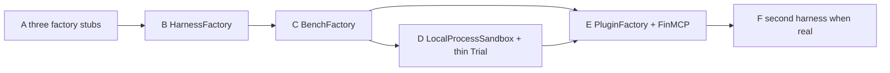

# Migration plan — current tree → FinAgentSandbox (slim)

| Field | Value |
| --- | --- |
| Title | Harbor registries first, thin implementations |
| Author | Grok CLI (slim pass) |
| Date | 2026-09-16 |
| Status | Draft (supersedes the Phase 0–5 encyclopedia of the same day) |
| Target design | [`SANDBOX_REPO_DESIGN.md`](SANDBOX_REPO_DESIGN.md) (interface sketches — **not** re-written here) |
| Harbor norms | [`HARBOR_NORMS.md`](HARBOR_NORMS.md) |

**Slimmed for Harbor registries + thin impl.** This file is the **implementation order**. Interface sketches (`BaseHarness`, `BenchAdapter`, `EnvPlugin`, `Trial`, seating matrix) live in `SANDBOX_REPO_DESIGN.md`. Do not treat that doc’s Phase 4 stub-harness / full Trial listing as the schedule.

**中文一句话：** 先立三个 Harbor 式注册口（Harness / Bench / EnvPlugin），实现保持薄（今天只填 Grok + 现有 adapter）；第二套真实 harness / plugin / bench = 只注册。不做 Harbor 镜像、不做空 Claude stub 里程碑。

---

## Invariants (every phase)

- **Do not wipe or rewrite metric values** in `reports/GROK_CLI_SCORECARD.*` or the **legacy flat** `artifacts/suite_results/{suite_id}.json` (Sep-12 Grok dumps). One scorecard per harness; optional rows use `tier=optional`.
- **Dump namespace (Phase B+):** write only `artifacts/suite_results/<harness>/{suite_id}.json`. Never write the flat path. Non-Grok never writes `grok-cli/`. Grok `--report-only` reads `grok-cli/` then falls back to the legacy flat file.
- **Seating:** a harness that cannot sit a `decide()`-bench **skips**; it does **not** HOLD-fill. Empty `suite_ids()` = sit none.
- **Provider ≠ 行情 / MCP plugin.** `LocalProcessSandbox` is isolation (session `HOME`). MCP / data env is `PluginFactory`. Yahoo harvest stays `runners/yahoo.py`. Cite [`HARBOR_NORMS.md`](HARBOR_NORMS.md) / [`SANDBOX_REPO_DESIGN.md`](SANDBOX_REPO_DESIGN.md); do not rewrite them in a code PR.
- `--suites all` = required five. `scripts/doctor.sh` stays green (or fails only on checks we added on purpose). Docker is never required.
- No phase implements a full Claude Code / Codex / OpenClaw harness. Empty stubs are **not** a milestone.

Registries stand up in **A → B → C** (PluginFactory map in A, filled in E). Sandbox/Trial is **after** the bench registry, and only as much as opted-in benches need `sandbox.exec_sync`. Decorative Harbor machinery (empty stubs, Daytona/Modal, parity science, unused Trial façades) is demoted to F / never.

---

## The three registration seams (the extension story)

Harbor’s lesson is the **factory map**, not a clone of Trial/Daytona. After Phase C (E for plugins), adding a thing is **register only**:

| Registry | Harbor cousin | Plug-in meaning | Thin fill today |
| --- | --- | --- | --- |
| **`HarnessFactory`** | `AgentFactory._AGENT_MAP` | New harness without rewriting the eval loop | `grok-cli` only |
| **`BenchFactory`** | Harbor `adapters/*` (our wrap) | New community bench without a new `ADAPTERS` dict in the Grok script | `EnvAdapterAsBench` around every existing `*EnvAdapter` |
| **`PluginFactory`** | `MCPServerConfig` / task files — **not** `EnvironmentType` | New tool/MCP/data env without a new sandbox type and without freezing the agent loop | empty map until FinMCP `McpPlugin` (Phase E) |

`SandboxFactory` (`local-process`) is a **provider** registry, not the third dynamic. Do not put Yahoo or MCP in it.

Second real harness / plugin / bench: add a module + one `_MAP` entry. Do not grow `run_suites` / `Trial` with `if harness == ...`.

---

## vs the previous Phase 0–5 plan

| Slim | Old | What changed |
| --- | --- | --- |
| A | Phase 0 | Docs already exist. Ship the **three factory modules** as stubs. |
| B | Phase 1 | Same: peel `GrokCliHarness`; namespaced dumps. |
| C | Phase 3 | **Pulled forward** — BenchFactory before sandbox/Trial. |
| D | Phase 2 | **Pushed back** — LocalProcessSandbox + thin Trial only when a bench needs exec. No heavy Harbor Trial until then. |
| E | Phase 5 Option A | PluginFactory + FinMCP `plugin_env` + `exec_sync`. No parity science. |
| F | Phase 4 + Phase 5 Option B | **Optional / later.** No empty Claude/Codex/OpenClaw smoke as a required milestone. Harbor-like Vals generate only if product asks. |

**Dropped as required work:** stub-harness smoke; full `ParityNote` JSON science; Plugin+Trial façades with nothing calling them; Daytona/Modal; inventing `EnvironmentType` for MCP.

---

## Phase A — three factory stubs (no behavior change)

**Effort:** S  
**Depends on:** nothing (paper docs already on `main`)  
**Goal:** the three registration seams exist as importable modules. Eval path unchanged.

### Files to add

| Path | Content |
| --- | --- |
| `sandbox/__init__.py` | package docstring; product name FinAgentSandbox |
| `sandbox/harness/__init__.py` + `factory.py` | `HarnessFactory._MAP = {"grok-cli": "sandbox.harness.grok_cli:GrokCliHarness"}`. `create` may `NotImplementedError` until B, **or** import and construct if `grok_cli.py` is a one-liner wrapper. Unknown name → `ValueError` listing keys. |
| `sandbox/benches/__init__.py` + `factory.py` | `BenchFactory._MAP` keys = today’s 11 `ALL_SUITE_IDS` (values may be TBD strings). `create` may `NotImplementedError`. |
| `sandbox/plugins/__init__.py` + `factory.py` | `PluginFactory._MAP = {}`. `create` → `ValueError` listing `[]`. |
| `sandbox/provider/__init__.py` | comment: `SandboxFactory` lands in D, not a plugin |
| `sandbox/runtime/__init__.py` | comment: thin Trial in D |

Prefer real `_MAP` dicts + a unit test that the keys exist over empty `__init__.py` comments. No `BaseHarness` / `Trial` bodies required in A.

### Files to change

| Path | Change |
| --- | --- |
| `pyproject.toml` | `include = ["adapters*", "runners*", "sandbox*"]` |
| `scripts/doctor.sh` | `REQUIRED_FILES` += `docs/paper/{HARBOR_NORMS,SANDBOX_REPO_DESIGN,MIGRATION_PLAN}.md`. `python -c "import sandbox"`; import the three factories. |
| `ARCHITECTURE.md` | 10-line pointer to `SANDBOX_REPO_DESIGN.md` (do not rewrite the four-layer story) |

Do not touch scorecards, `artifacts/suite_results/`, adapter run paths, or `runners/grok.py`.

### Acceptance

- `./scripts/doctor.sh` exit 0.
- `git diff --stat reports/ artifacts/suite_results/` empty.
- `HarnessFactory._MAP` has `grok-cli` only; `BenchFactory._MAP` has 11 suite ids; `PluginFactory._MAP` is empty.
- `python scripts/run_grok_cli_eval.py --dry` unchanged.

---

## Phase B — HarnessFactory + peel Grok; shared `run_suites`

**Effort:** M  
**Depends on:** A  
**Goal:** `HarnessFactory.create("grok-cli")` is the unit under test. Only `grok-cli` is registered. Eval loop no longer owns harness construction.

### Files to add

| Path | Content |
| --- | --- |
| `sandbox/harness/base.py` | `BaseHarness`, instance `features()`, `suite_ids()` (empty = none). Sketches in `SANDBOX_REPO_DESIGN.md`. |
| `sandbox/harness/grok_cli.py` | `GrokCliHarness` wrapping `GrokRunner` + `GrokCliAgentAdapter`; `suite_ids()=ALL_SUITE_IDS`; `features().mcp_servers` from backend |
| `sandbox/runtime/run_suites.py` | extracted loop: extras, dump namespace, seating skip, compose scorecard |
| `scripts/run_eval.py` | generic CLI `--harness` default `grok-cli`; calls `run_suites` |
| `tests/unit/test_harness_factory.py` | factory + dump path |

### Files to move/change

| Path | Change |
| --- | --- |
| `sandbox/harness/factory.py` | `create` returns a real `GrokCliHarness`; unknown name → `ValueError` listing `grok-cli` |
| `runners/grok.py` | Stay low-level (`GrokRunner`, OIDC). `GrokCliAgentAdapter` stays; `GrokCliHarness.as_agent_adapter()` returns it. Do not duplicate OIDC. |
| `scripts/run_grok_cli_eval.py` | Thin alias into `run_suites(harness_name="grok-cli", ...)`. Keep `ADAPTERS`/`PROTOCOLS` until C if the loop still imports them; prefer one loop so the two CLIs cannot fork. |
| `dump_suite` / `load_suite` | Write `artifacts/suite_results/grok-cli/{sid}.json` only. Load: namespaced then **fallback** legacy flat. Never write flat. |
| `scripts/v2_suite_ops.py` | Same dump/load helpers (still Grok-only). |

Do not rewrite `GrokCliAgentAdapter.decide` schemas; do not treat `AgentAdapter.capabilities()` empty as the skip gate (that is `suite_ids()`). Do not register stub harness names.

### Acceptance

- `python scripts/run_grok_cli_eval.py --dry` still skip-holds the required five.
- `python scripts/run_eval.py --harness grok-cli --dry` equivalent (same `run_suites`).
- `HarnessFactory.create("grok-cli").name() == "grok-cli"`.
- `HarnessFactory.create("claude-code")` raises `ValueError` listing `grok-cli` only.
- `--report-only` recomposes the harness scorecard from `grok-cli/` **or** legacy flat Sep-12 JSON.
- A dry Grok run does not rewrite Sep-12 flat files.
- Existing in-process suites still import `GrokCliAgentAdapter`.
- Optional rows share the same harness scorecard (`GROK_CLI_SCORECARD.*` for grok-cli) with `tier=optional`.
- doctor green; no scorecard hash tests.

---

## Phase C — BenchFactory wraps existing EnvAdapters

**Effort:** M  
**Depends on:** B  
**Goal:** `BenchFactory.create("stockbench.daily_sim")` **always** returns `EnvAdapterAsBench` wrapping `StockBenchEnvAdapter`. The 11-entry `ADAPTERS` dict is no longer the source of truth. Same PR moves `PROTOCOLS` + `ALIASES`.

No SuiteResult / admission rewrite. Default wrapper **ignores sandbox** (host subprocess as today). Opt-in exec is E.

### Files to add

| Path | Content |
| --- | --- |
| `sandbox/benches/base.py` | `BenchAdapter` Protocol (**no default method bodies**) |
| `sandbox/benches/wrap.py` | `EnvAdapterAsBench` — factory **always** returns this |
| `sandbox/benches/factory.py` | fill `_MAP` of all 11 `ALL_SUITE_IDS`; `ProtocolFactory` from `runners/protocols.py`; `SUITE_ALIASES` |

Do **not** add a parity JSON science project. A `ParityNote` dataclass may exist; empty / unused is fine. No `parity/*.json` required.

### Files to change

| Path | Change |
| --- | --- |
| `run_grok_cli_eval.py` / `run_eval.py` / `run_suites.py` | Drop inline `ADAPTERS`/`PROTOCOLS`/`ALIASES`; call factories. |
| `adapters/base.py` | keep `EnvAdapter` Protocol **unchanged**. One-line comment pointing at `BenchAdapter`. Do not rename `EnvAdapter` (every adapter file and doctor import it). |
| Each `adapters/*.py` | no signature change. |

Do not change `SuiteResult` fields, `evaluate_admission`, or force `sandbox.exec` on all 11 benches.

### Acceptance

- `python scripts/run_grok_cli_eval.py --report-only` recomposes the harness scorecard from `grok-cli/` **or** legacy flat; suite **rows** (metrics) unchanged.
- `BenchFactory.create("finsaber.long_horizon").suite_id == "finsaber.long_horizon"` and `.run_official` exists (wrapper, not the raw class).
- Unknown suite_id → `ValueError` with known ids.
- doctor: import factory; still checks each `adapters/{name}.py` exists.
- Sep-12 `artifacts/suite_results/ama.multi_market_live.json` still present and bit-identical.

---

## Phase D — LocalProcessSandbox + thin Trial (when needed)

**Effort:** M  
**Depends on:** C (bench ids are in the factory)  
**Goal:** `BaseSandbox.start/exec/exec_sync/stop` exists. First backend is **local process**, not Docker. A **thin** `Trial` / run path can pass `sandbox` into opted-in benches. **Do not** force all 11 benches through exec. Existing adapters may keep calling `subprocess` directly.

Do **not** build a Harbor Trial state machine (no Daytona, no verifier env split, no job orchestrator). `config.plugins` is ignored (`[]`) until E. `PluginFactory` already exists from A; D does not have to call it.

### Files to add

| Path | Content |
| --- | --- |
| `sandbox/provider/base.py` | `BaseSandbox`, `ExecResult`; `exec` (async) + **`exec_sync`** (`subprocess.run`); `session_home` |
| `sandbox/provider/factory.py` | `_MAP = {"local-process": "sandbox.provider.local_process:LocalProcessSandbox"}` |
| `sandbox/provider/local_process.py` | session root `artifacts/_sessions/<id>/{work,home}`; `HOME`/`XDG_CONFIG_HOME` overlay; `python=` from extras |
| `sandbox/runtime/config.py` | `TrialConfig` dataclass (execute, artifacts_dir, python, plugins) |
| `sandbox/runtime/trial.py` | Thin `Trial.run`: extras, `suite_ids` skip, `to_thread(_run_official_sync)`, error→`SuiteStatus.ERROR`, `finally` stop. Bench/protocol via **factories from C**. Plugins `[]`. |

### Files to change

| Path | Change |
| --- | --- |
| `sandbox/harness/base.py` | `setup(self, sandbox)` real; `bind_mcp` unused until a harness-native MCP bench |
| `sandbox/harness/grok_cli.py` | `setup` may no-op for API backend; for CLI backend, `await sandbox.exec(["grok", "--version"])` and write native config **only** under `sandbox.session_home` |
| `scripts/doctor.sh` | import `sandbox.provider.local_process` |

Do not write harness config to the operator `$HOME`. Do not import `PluginFactory` into Trial until E has a consumer. Do not claim all 11 benches use `exec_sync`.

### Acceptance

- `LocalProcessSandbox` round-trip: `start` → `exec_sync(["echo", "ok"])` return_code 0 → `stop`. After start, `session_home` exists and `HOME` in exec env points there.
- Dry-run on `ama.multi_market_live` with `execute=false` returns skip `SuiteResult` (existing `protocol.extra.execute`).
- A harness whose `suite_ids()` omits AMA returns skip **without** calling `decide()`.
- doctor does not mention docker as a fail.
- Scorecards and flat suite_results untouched.

`LocalProcessSandbox` accepts `python: Path | None` so optional suites keep `venvs/v2_finsearch/bin/python`. Do not merge venvs.

---

## Phase E — EnvPlugin registry + FinMCP as first consumer

**Effort:** M–L  
**Depends on:** D (sandbox + thin Trial), C (benches)  
**Goal:** **dynamic env connected to a bench** without changing the official FinMCP protocol.

`McpPlugin.mount` returns **`plugin_env` only** → Trial copies it onto `protocol.extra` (no `bind_mcp`, no Grok API skip) → `FinMcpEnvAdapterAsBench.run_official` calls **`sandbox.exec_sync`**. Yahoo harvest stays `runners/yahoo.py` until product asks.

### Files

| Path | Change |
| --- | --- |
| `sandbox/plugins/base.py` | `EnvPlugin`, `PluginMount`, local `MCPServerConfig` fields |
| `sandbox/plugins/factory.py` | `_MAP = {"mcp": "sandbox.plugins.mcp:McpPlugin"}` |
| `sandbox/plugins/mcp.py` | `mount(sandbox) -> PluginMount(env=..., mcp_servers=[])`. **No harness argument. No native config writes.** |
| `sandbox/runtime/trial.py` | collect mounts; copy `env` to `protocol.extra["plugin_env"]`; `bind_mcp` **only** if `mcp_servers` non-empty (FinMCP does not) |
| `sandbox/benches/wrap.py` | `FinMcpEnvAdapterAsBench.run_official` (sync) uses `sandbox.exec_sync([python, ...], env=plugin_env)` |
| `adapters/finmcp.py` | keep skip without Qieman URL; prefer `plugin_env` over raw `os.environ` when present |

### Acceptance

- `McpPlugin.mount` does not import `BaseHarness`, does not write `config.toml`, returns empty `mcp_servers`.
- FinMCP `run_official` invokes `sandbox.exec_sync` (not `await exec`). Dry skip still OK if URL missing.
- Grok API (`GROK_EVAL_BACKEND=api`) still **sits** FinMCP when the Qieman URL is set (no Trial skip on `features().mcp_servers`).
- FinMCP still skips without Qieman URL (no fake servers).
- `protocol.extra["python"]` is the v2_finmcp venv; sandbox.python matches.
- `doctor.sh` imports `sandbox.plugins.factory`.
- Scorecards and Sep-12 flat suite_results not wiped.
- Other ten benches: still host-process until they opt in.

Do not write MCP config from `EnvPlugin.mount`. Do not move `runners/yahoo.py` into `PluginFactory`. Vals Harbor-like `generate` is **not** this phase (official CLI-bridge stays the scored path).

---

## Phase F — second harness **when real** (optional / later)

**Effort:** S–L depending on the real harness  
**Depends on:** B factory; C so a dry suite run is harness-parameterized; seating skip from B/D  
**Goal:** register a **real** second harness (Claude Code, Codex, OpenClaw, or import-path custom). **Not** an empty stub smoke.

There is **no** required “add `claude_code.py` with `suite_ids()=set()` and dry-run AMA” milestone. A stub that sits nothing proves only that `ValueError` listing grew; it is allowed as a **local** experiment, not a merge gate.

When a real harness lands:

- Append one `_MAP` entry. `suite_ids()` lists benches it can actually sit (mapper or overlay exists).
- Cannot sit `decide()`-benches → **skip**, not HOLD.
- Dumps only under `artifacts/suite_results/<that-harness>/`. Never flat, never `grok-cli/`.
- Reports: `{HARNESS}_SCORECARD.*` (gitignore in CI unless we intend to keep them). **Never** write `reports/GROK_CLI_SCORECARD.*`.
- doctor still 0.

---

## Cross-phase acceptance matrix

| Check | A | B | C | D | E | F |
| --- | --- | --- | --- | --- | --- | --- |
| `./scripts/doctor.sh` exit 0 | ✓ | ✓ | ✓ | ✓ | ✓ | ✓ |
| Grok scorecard metrics not rewritten | ✓ | ✓ | ✓ | ✓ | ✓ | ✓ |
| Legacy flat Sep-12 `suite_results/{sid}.json` unread-write | ✓ | ✓ | ✓ | ✓ | ✓ | ✓ |
| Non-Grok dumps never land in flat or `grok-cli/` | — | ✓ | ✓ | ✓ | ✓ | ✓ |
| `REQUIRED_SUITE_IDS` unchanged; `--suites all` = required five | ✓ | ✓ | ✓ | ✓ | ✓ | ✓ |
| Grok dry eval skip/hold still works | — | ✓ | ✓ | ✓ | ✓ | ✓ |
| Three factories importable; unknown name → `ValueError` + known keys | ✓ | ✓ | ✓ | ✓ | ✓ | ✓ |
| Second harness cannot clobber Grok reports **or** Grok suite_results | — | — | — | — | — | ✓ |
| FinMCP uses `sandbox.exec_sync` (or honest skip); Grok API still sits | — | — | — | — | ✓ | ✓ |
| Docker not required | ✓ | ✓ | ✓ | ✓ | ✓ | ✓ |

---

## PR mapping / rollback

One phase ≈ one PR (E may split plugin vs FinMCP wrap). Do not squash scorecard JSON into refactor commits. Author: Ao Wang / `aowang-ai@users.noreply.github.com`.

Rollback is additive (no scorecard migration): delete `sandbox/` (A); construct `GrokCliAgentAdapter()` in the Grok CLI (B); keep `EnvAdapter` SPI (C); benches ignore `sandbox` (D); ignore `plugin_env` (E); unregister the extra harness name (F).
