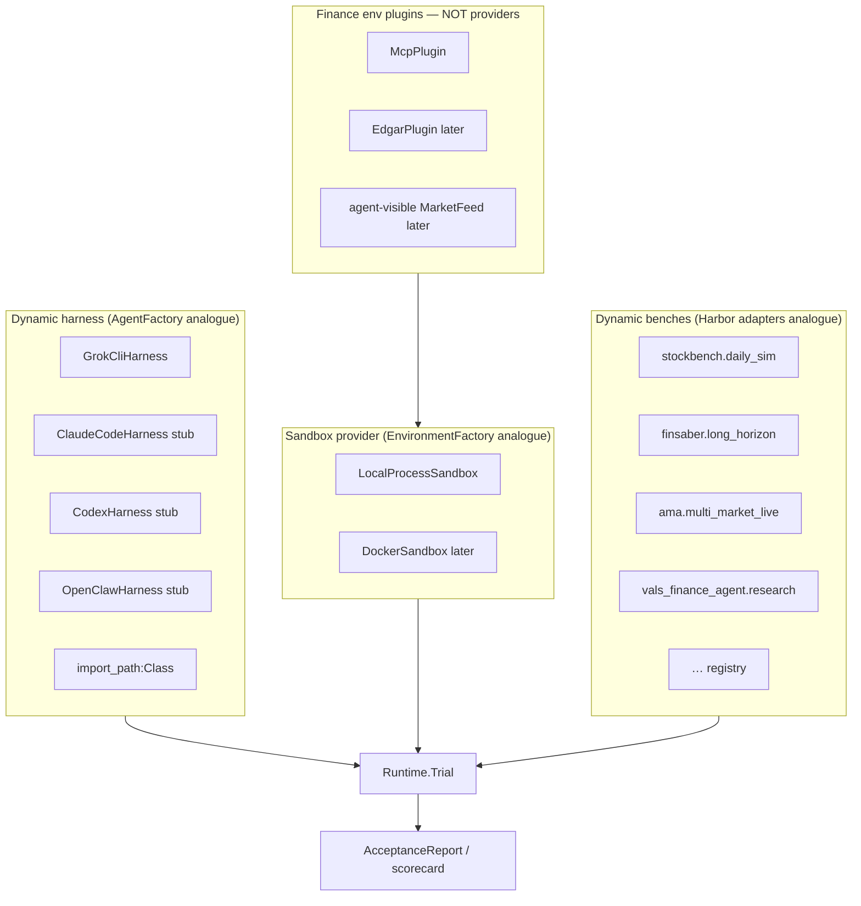
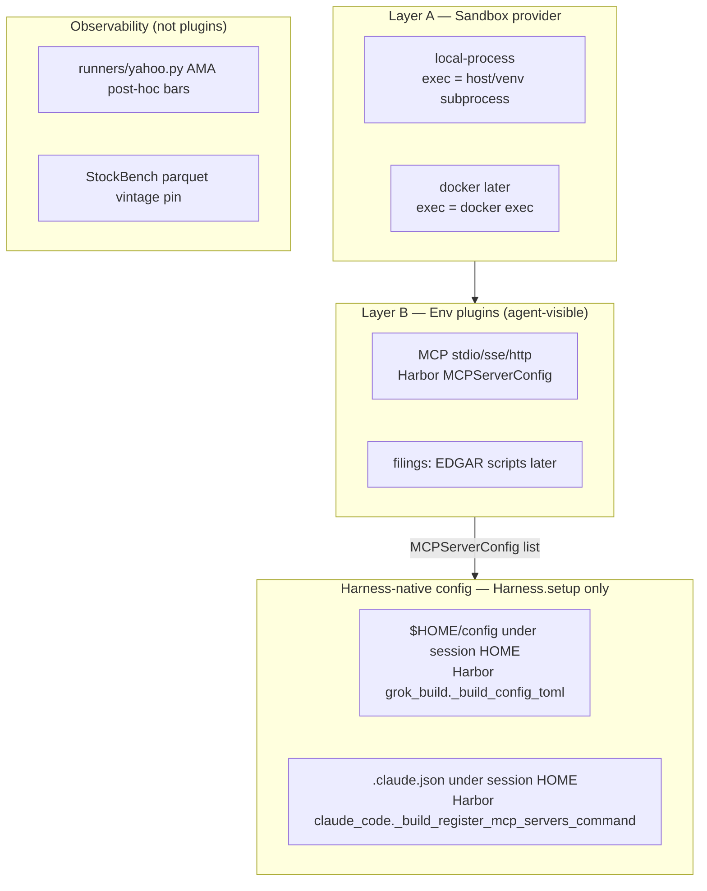

# FinAgentSandbox — repo design

| Field | Value |
| --- | --- |
| Title | Finance agent sandbox evaluation layer (Harbor-primary) |
| Author | Grok (design-doc-writer) |
| Date | 2026-09-16 |
| Status | Draft |
| Product name | **FinAgentSandbox** (git path: `aowang-ai/finagent-sandbox`) |
| Companion | [`HARBOR_NORMS.md`](HARBOR_NORMS.md), [`MIGRATION_PLAN.md`](MIGRATION_PLAN.md) (slimmed: three registries first; empty stub harnesses are not a required milestone) |

Harbor clone cited throughout as a local reference (`/workspace/refs/harbor` on the design machine). This tree is `finagent-sandbox`.

---

## North-star one-pager (三动态)

Eval infra that scores **agent harnesses** on **community finance benches** inside a **composable sandbox**, and emits the existing parallel scorecard. Innovation is the product of three independent axes — not “versioning”:

| Axis | Meaning | Harbor analogue (code, not slogan) | First instance here |
| --- | --- | --- | --- |
| **Dynamic harness** | Claude Code / Codex / OpenClaw / Grok CLI / custom multi-agent plug into the **same** sandbox + benches | `BaseAgent` + `AgentFactory._AGENT_MAP` | `GrokCliHarness` peeled from `runners/grok.py` |
| **Dynamic environment** | MCP tools, data sources, market feeds added **without freezing** one agent loop | `BaseEnvironment` (provider) **plus** `MCPServerConfig` / skills (plugins). These are **two Harbor types**. | `LocalProcessSandbox` (session `HOME`) + `McpPlugin`; Yahoo harvest stays observability (`runners/yahoo.py`) |
| **Dynamic bench** | Continuously compose StockBench, FINSABER, AMA, Vals, … | `adapters/*/adapter.py` `generate_task` / `run` + parity JSON | Today’s `EnvAdapter` becomes `BenchAdapter`; Harbor-like generate is Phase 5 |

**RQ (unchanged from `GOAL.md`):** on community-established, protocol-complete finance evaluations, how much does the **harness** (vs backbone LLM) move results — and is that stable across trading, honesty, portfolio, tools, and research/search?

We still do **not** invent exam papers. We still do **not** veto suite A because suite B failed. `admission.decision` remains scorecard completeness (`adapters/base.py:evaluate_admission`).



---

## Honest map of the current tree

What already looks like Harbor, what is Grok glue, what the three dynamics still lack.

### Already Harbor-shaped (keep)

| Current symbol | File | Harbor cousin | Gap |
| --- | --- | --- | --- |
| `EnvAdapter` Protocol (`suite_id`, `module_dir`, `describe()`, `run(agent, protocol) -> SuiteResult`) | `adapters/base.py` L416–427 | Adapter + a slice of Trial | `run` both *is* the exam and *is* the environment; no generate-task path; no factory class |
| Concrete `*EnvAdapter` classes | `adapters/{stockbench,ama,finsaber,deepfund,fintoolbench,investorbench,livetradebench,finmcp,vals_finance_agent,finsearchcomp,openpm}.py` | `adapters/financeagent/adapter.py` (compose upstream) | Hardcoded in `scripts/run_grok_cli_eval.py:ADAPTERS` |
| `ProtocolSpec` + `canonical_protocol_hash` | `adapters/base.py` | Harbor `task.toml` pins | Keep; this is our exam-paper identity |
| `SuiteResult` / `AcceptanceReport` / `evaluate_admission` | `adapters/base.py`, `ACCEPTANCE_REPORT.schema.json` | Harbor `TrialResult` + verifier reward | Keep; Harbor has no parallel finance scorecard |
| `AgentAdapter.decide(Observation) -> Decision` | `adapters/base.py` L396–412 | **Not** `BaseAgent`. LCD at a *native-surface boundary* | Useful for AMA/FINSABER/FinTool; unused by StockBench/DeepFund CLI bridges (`docs/engineering/GLUE.md`) |
| `runners/scorecard.py:write_scorecard` | default `runner_name="GROK_CLI"` | n/a | Already parameterized; do not default-overwrite other harnesses onto `GROK_CLI_SCORECARD.*` |

### Grok-specific glue (peel into one harness)

| Piece | File | Why it is not a sandbox |
| --- | --- | --- |
| `GrokRunner.complete_json`, OIDC refresh, `LOCKED_SYSTEM`, `DECISION_SCHEMA` | `runners/grok.py` | Model loop + auth |
| `GrokCliAgentAdapter` (`agent_id="grok-cli"`) | `runners/grok.py` L640 | Implements `AgentAdapter`; `capabilities()` lists only v1 five |
| `scripts/run_grok_cli_eval.py` | ADAPTERS/PROTOCOLS dicts, `--suites`, scorecard path policy | Job CLI frozen to one harness |
| Overlay YAML / xAI `base_url` patches | `adapters/stockbench.py`, `adapters/deepfund.py`, `adapters/v2_runtime.py:xai_env` | LLM backend injection, not exam logic |
| `GROK_EVAL_BACKEND=api\|cli`, `GROK_EVAL_MODEL` | env | Harness options |

### Missing for the three dynamics

1. **Harness:** no `BaseHarness.setup/run`. No factory. Second harness cannot sit AMA without copying `GrokCliAgentAdapter`. Claude Code / Codex / OpenClaw are documented as deferred (`GOAL.md`).
2. **Environment:** no session abstraction. Suites exec on the host (or a suite-private venv). MCP is a **bench** (`finmcp.tool_mcp`) rather than a plugin any bench can mount. `runners/yahoo.py` is AMA harvest glue, not a registered data plugin. There is no `start/exec/stop`.
3. **Bench:** no `BenchAdapter` registry class; `ADAPTERS` is a dict in the Grok script. No Harbor-like `generate_task`. No `adapter_metadata.json` / parity sidecar. `EnvAdapter` conflates “exam room” with “world the agent may touch” (`ARCHITECTURE.md` four layers).

---

## Module map (target)

Aligned to Harbor terms. **Package name:** `sandbox` (new). Existing `adapters/` and `runners/` remain until each phase moves them. `modules/` stays gitignored upstream clones.

```
finagent-sandbox/                  # git name; product: FinAgentSandbox
├── sandbox/                       # NEW package (pyproject include)
│   ├── __init__.py
│   ├── harness/                   # Harbor agents/
│   │   ├── base.py                # BaseHarness
│   │   ├── factory.py             # HarnessFactory
│   │   ├── grok_cli.py            # GrokCliHarness  (Phase 1)
│   │   ├── claude_code.py         # stub (Phase 4)
│   │   ├── codex.py               # stub (Phase 4)
│   │   └── openclaw.py            # stub (Phase 4)
│   ├── provider/                  # Harbor environments/  — sandbox providers ONLY
│   │   ├── base.py                # BaseSandbox
│   │   ├── factory.py             # SandboxFactory
│   │   ├── local_process.py       # Phase 2
│   │   └── docker.py              # later; not Phase 2
│   ├── plugins/                   # finance env plugins — NOT providers
│   │   ├── base.py                # EnvPlugin
│   │   ├── factory.py             # PluginFactory
│   │   ├── mcp.py                 # Phase 5 (agent-visible tools)
│   │   └── edgar.py               # later; not Yahoo harvest
│   ├── benches/                   # Harbor adapters/  — wrap adapters/*.py
│   │   ├── base.py                # BenchAdapter Protocol (no default bodies)
│   │   ├── wrap.py                # EnvAdapterAsBench — factory always returns this
│   │   ├── factory.py             # BenchFactory + ProtocolFactory + ALIASES
│   │   └── parity.py              # metadata + notes helpers
│   ├── runtime/                   # Harbor trial/
│   │   ├── trial.py               # Trial (extras, to_thread + exec_sync, skip gate)
│   │   ├── run_suites.py          # shared loop for both CLIs
│   │   └── config.py              # TrialConfig
│   └── scorecard/                 # keep current report types
│       └── __init__.py            # re-export adapters.base report dataclasses
├── adapters/                      # KEEP until Phase 3; EnvAdapter.run stays
├── runners/                       # KEEP Grok until Phase 1 peel; yahoo.py stays harvest
├── scripts/run_eval.py            # Phase 1: generic CLI (`--harness`)
├── scripts/run_grok_cli_eval.py   # thin alias: run_eval --harness grok-cli
├── reports/                       # DO NOT WIPE GROK_CLI_SCORECARD.*
├── artifacts/suite_results/       # Sep-12 flat JSON stays; new dumps go under <harness>/
└── docs/paper/                    # this design
```

| Directory | Responsibility | Harbor term | Must not do |
| --- | --- | --- | --- |
| `sandbox/harness/` | Install + drive an agent loop | `BaseAgent` | Own fills, judges, or Yahoo |
| `sandbox/provider/` | Isolation: process or container | `BaseEnvironment` | Know tickers or MCP schemas |
| `sandbox/plugins/` | MCP, filings, agent-visible feeds | `MCPServerConfig` + task files | Appear in `SandboxFactory`; host harvest (Yahoo) is not a plugin |
| `sandbox/benches/` | Compose one upstream exam | `adapters/*` | Invent a new protocol |
| `sandbox/runtime/` | start sandbox → setup harness → run bench → harvest | `Trial` | Hardcode `grok-cli`; dump into another harness’s suite_results |
| `sandbox/scorecard/` | `SuiteResult` → `AcceptanceReport` | (ours) | Change `SCHEMA_VERSION` without a migration |
| `modules/` | Upstream clones | Harbor datasets source | Fork prompts into this repo |
| `reports/` | Canonical Grok + future harness files | Harbor `jobs/` | Overwrite `GROK_CLI_SCORECARD.*` from non-Grok runs |
| `artifacts/suite_results/` | Per-harness dumps + **legacy flat Grok Sep-12 JSON** | Harbor `trials/` | Non-Grok writes to the flat `*.json` or to `grok-cli/` |

`ARCHITECTURE.md` “four layers” (Environment / Task suite / Observability / Parallel scorecard) maps as:

| ARCHITECTURE.md layer | Target type | Note |
| --- | --- | --- |
| Environment (“world the agent may touch”) | `BaseSandbox` **+** `EnvPlugin`s **+** upstream engine | Split so Docker ≠ 行情 |
| Task suite | `BenchAdapter` + `ProtocolSpec` | `suite_id` stays |
| Observability | harvest of official artifacts | unchanged |
| Parallel scorecard | `evaluate_admission` / `write_scorecard` | unchanged |

---

## Public interfaces

Sketches are the Phase 1–5 contract. Names are ours; Harbor cousins are cited so implementers do not invent a third vocabulary.

### `BaseHarness` (Harbor `BaseAgent.setup` / `run`)

Two capability systems exist today and must not be conflated:

| System | Where | Meaning today | Meaning after Phase 1 |
| --- | --- | --- | --- |
| `AgentAdapter.capabilities() -> set[str]` | `adapters/base.py` L407–409 | **suite ids**; **empty = all**. `GrokCliAgentAdapter` lists the v1 five (`runners/grok.py` L648–655). **Nothing in the runner calls this** (`scripts/run_grok_cli_eval.py` never checks it). | Unchanged on the Protocol (dummy adapters). **Not** the Trial gate. |
| `BaseHarness.suite_ids() -> set[str]` | new | n/a | **Trial skip gate.** Empty = sit **none** (stubs). Grok lists every suite it will attempt (`ALL_SUITE_IDS`, including v2). |
| `BaseHarness.features() -> HarnessCapabilities` | new (Harbor `AgentCapabilities`) | n/a | Runtime flags. **`mcp_servers` is an instance property**, not a ClassVar: Grok API vs CLI is `GROK_EVAL_BACKEND` on one class (`runners/grok.py` L262), unlike Harbor where `GrokBuild` vs `ClaudeCode` are separate classes. |

```python
# sandbox/harness/base.py
from abc import ABC, abstractmethod
from dataclasses import dataclass

@dataclass
class HarnessCapabilities:
    """Harbor AgentCapabilities analogue. Not a ClassVar: Grok API vs CLI differ."""
    decide_lcd: bool = False         # as_agent_adapter().decide is implemented
    native_cli: bool = False         # installed CLI inside sandbox (Harbor grok-build)
    mcp_servers: bool = False        # setup() will write MCP into session HOME
    skills: bool = False

class BaseHarness(ABC):
    """Unit under test. Sits only the benches in suite_ids(); empty means none.

    Harbor cousin: harbor.agents.base.BaseAgent
    Current cousin: adapters.base.AgentAdapter + runners.grok.GrokCliAgentAdapter
    """

    @staticmethod
    @abstractmethod
    def name() -> str:
        """Registry key, e.g. 'grok-cli'. Stubs 'claude-code' land in Phase 4, not Phase 1."""

    @abstractmethod
    def version(self) -> str | None: ...

    def features(self) -> HarnessCapabilities:
        return HarnessCapabilities()

    def suite_ids(self) -> set[str]:
        """Benches this instance will sit. Empty = sit none (NOT AgentAdapter empty=all)."""
        return set()

    def as_agent_adapter(self) -> "AgentAdapter":
        """LCD for benches whose seating cell is decide() (AMA, FINSABER, FinTool).

        Must not be called unless features().decide_lcd and suite_id in suite_ids().
        CLI-overlay benches must not HOLD-fill via a dummy decide().
        """
        raise NotImplementedError(f"{self.name()} does not expose decide()")

    async def setup(self, sandbox: "BaseSandbox") -> None:
        """Harbor BaseAgent.setup: install CLI; write MCP/skills into **sandbox HOME**.

        The only place that writes ~/.grok/config.toml or ~/.claude.json.
        Plugins do not take a harness argument (see EnvPlugin).
        LocalProcessSandbox API-backend Grok: no-op besides recording features().
        """

    async def run(
        self,
        instruction: str,
        sandbox: "BaseSandbox",
        context: dict,
    ) -> None:
        """Harbor BaseAgent.run. Used only for Harbor-like tasks (Phase 5 Option B).

        Official-CLI benches call BenchAdapter.run_official, not this.
        """
        raise NotImplementedError

    def bind_mcp(self, servers: list["MCPServerConfig"]) -> None:
        """Store Harbor-shaped MCPServerConfig for setup() to write native files.

        Analogous to BaseAgent.__init__(mcp_servers=...). Empty list is a no-op.
        FinMCP does **not** call this: Qieman MCP is consumed by DianJin-TIR infer,
        not by ~/.grok/config.toml (adapters/finmcp.py L80–81 `_ = agent`, L166–178 YAML).
        """
        self._mcp_servers = list(servers)

    def preflight(self) -> None:
        """Harbor BaseAgent.preflight analogue: credentials present?"""
```

`GrokCliHarness` wraps today’s `GrokRunner` + `GrokCliAgentAdapter`. `name() == "grok-cli"`. `as_agent_adapter()` returns the existing adapter so `EnvAdapter.run(agent, protocol)` does not change in Phase 1. `features().mcp_servers` is True only when `GROK_EVAL_BACKEND=cli`. `suite_ids()` returns `set(ALL_SUITE_IDS)` so v2 still runs (today’s orchestrator ignores `AgentAdapter.capabilities()`).

**Phase 1 / 4 must add the skip check** — it does not exist today.

### Harness × bench seating matrix

A second *real* harness is not a dummy `decide()` that HOLD-fills AMA (that **is** an exam run). Overlay injection (`llm_profiles.grok`, `adapters/v2_runtime.py:xai_env`) is Grok-specific until generalized. Cells:

| `suite_id` | Native surface / mapper | Grok API (`decide_lcd`, no MCP) | Grok CLI backend (`decide_lcd` + `mcp_servers`) | Phase 4 stub (`suite_ids()=∅`) | Later native-CLI (`decide_lcd=false`, `native_cli=true`) |
| --- | --- | --- | --- | --- | --- |
| `ama.multi_market_live` | `AmaHttpShim` → `decide()` BUY/SELL/HOLD (`adapters/ama.py`) | **sit** | **sit** | **skip** (not HOLD) | **skip** until a mapper exists |
| `finsaber.long_horizon` | `BaseStrategyIso.on_data` → `framework.buy/sell` | **sit** | **sit** | **skip** | **skip** until mapper |
| `fintoolbench.tool_compliance` | `decide()` emits JSONL; official `run_relative_eval.py` | **sit** | **sit** | **skip** | **skip** until mapper |
| `stockbench.daily_sim` | official CLI + YAML overlay (`_ = agent`; `llm_profiles.grok`) | **sit** (Grok overlay) | **sit** | **skip** (overlay is Grok-specific) | **skip** until a generic `OPENAI_BASE_URL` overlay is designed |
| `deepfund.fund_arena` | official `main.py` + Grok YAML (`_ = agent`) | **sit** | **sit** | **skip** | **skip** until generic YAML |
| `investorbench.decision` | official docker `devon` | skip if docker missing | skip | **skip** | skip |
| `livetradebench.live` | official `backtest_demo.py` + model filter | **sit** | **sit** | **skip** | **skip** until overlay |
| `finmcp.tool_mcp` | official infer+eval YAML (`_ = agent`); Qieman URL in `infer_config.yaml` | **sit if Qieman URL** (same as today; MCP is bench-owned) | **sit if Qieman URL** | **skip** | **sit if Qieman URL** (still official CLI, not harness MCP) |
| `vals_finance_agent.research` | official `finance-agent` CLI + xAI `.env` | **sit** | **sit** | **skip** | **skip** until overlay |
| `finsearchcomp.search` | official `chat.py`/`eval.py` | **sit** | **sit** | **skip** | **skip** until overlay |
| `openpm.portfolio_pit` | official `llm_tiered` | **sit** | **sit** | **skip** | **skip** until overlay |

Out of scope vs Phase 4: stubs never sit; they never HOLD-fill; they never write Grok-owned dumps. Generalizing StockBench/DeepFund overlays to Claude is a **later** PR after a real Claude harness, not implied by the stub.

### `HarnessFactory` (Harbor `AgentFactory`)

Phase 1 map is **grok-cli only**. Stubs are appended in Phase 4. Import-path escape is Phase 1 (Harbor `create_agent_from_config` treats `name` containing `:` as an import path).

```python
# sandbox/harness/factory.py  — Phase 1
class HarnessFactory:
    _MAP = {
        "grok-cli": "sandbox.harness.grok_cli:GrokCliHarness",
        # Phase 4 appends claude-code / codex / openclaw. Do not copy them here in Phase 1.
    }

    @classmethod
    def create(cls, name: str | None = None, *, import_path: str | None = None, **kwargs) -> BaseHarness:
        ...
```

`HarnessFactory.create("claude-code")` in Phase 1 raises `ValueError` listing `['grok-cli']`.

### `BaseSandbox` (Harbor `BaseEnvironment`) — provider only

```python
# sandbox/provider/base.py
class ExecResult:
    stdout: str | None
    stderr: str | None
    return_code: int

class BaseSandbox(ABC):
    """Isolation provider. Harbor cousin: harbor.environments.base.BaseEnvironment.

    NOT a market-data plugin. MCP attaches via EnvPlugin.mount(sandbox) → MCPServerConfig.
    """

    session_home: Path  # set in start(); harness-native writes go here, never operator $HOME

    @staticmethod
    @abstractmethod
    def type() -> str:
        """'local-process' | 'docker' | custom str (Harbor type() is str for this reason)."""

    @abstractmethod
    async def start(self, *, force_build: bool = False) -> None: ...

    @abstractmethod
    async def stop(self, *, delete: bool = True) -> None: ...

    @abstractmethod
    async def exec(
        self,
        argv: list[str],
        *,
        cwd: str | None = None,
        env: dict[str, str] | None = None,
        timeout_sec: float | None = None,
    ) -> ExecResult:
        """argv is a list (no implicit shell). For a shell line use argv=['bash', '-lc', script].
        Used from async harness.setup / Harbor-like agent.run. Official-CLI benches must
        call exec_sync instead (see below)."""

    def exec_sync(
        self,
        argv: list[str],
        *,
        cwd: str | None = None,
        env: dict[str, str] | None = None,
        timeout_sec: float | None = None,
    ) -> ExecResult:
        """Sync subprocess.run analogue of exec. **This is what EnvAdapterAsBench
        / FinMCP run_official call.** Matches adapters/v2_runtime.py:run_logged.

        LocalProcessSandbox: subprocess.run(argv, cwd=..., env=merge(HOME, env)).
        Cannot be implemented as await exec() from a worker thread.
        """
        raise NotImplementedError(f"{self.type()} exec_sync")

    def scoped_exec_env(self, env: dict[str, str]):
        """Optional sync context manager merging env into subsequent exec/exec_sync.

        Harbor's BaseEnvironment.scoped_exec_env (environments/base.py L450) is a
        ContextVar overlay for concurrent asyncio tasks. LocalProcessSandbox does
        **not** need that: it is a process-wide dict merge on this instance, stacked
        while the `with` is entered. Skip the manager entirely if the caller passes
        env= into exec_sync (Phase 5 FinMCP should pass plugin_env that way).
        """
        raise NotImplementedError

    async def upload_file(self, source, target: str) -> None:
        raise NotImplementedError(f"{self.type()} upload_file")

    async def download_file(self, source: str, target) -> None:
        raise NotImplementedError(f"{self.type()} download_file")
```

**Phase 2 first backend:** `LocalProcessSandbox`

- `python: Path | None` — copied from `protocol.extra["python"]` (`adapters/v2_runtime.py:repo_venv_python` / `default_eval_python()`). `exec` / `exec_sync` do not rewrite argv[0] unless the bench asks; benches that opt in pass `[str(self.python), *rest]`.
- Session root: `artifacts/_sessions/<session_id>/`
  - `work/` — cwd
  - `home/` — `HOME` and `XDG_CONFIG_HOME=home/.config`
- Env overlay on every `exec`: `HOME=<session>/home`. Operator credentials stay readable via explicit vars (`GROK_AUTH_JSON` / `XAI_API_KEY` pointing at the real `~/.grok/auth.json`) so OIDC still works; **`config.toml` / `.claude.json` writes must land under session HOME**.
- `start` mkdirs + writes a `session.env`; `stop` does not delete operator `$HOME`.
- Host-process is **not** isolation (see Risks). **`DockerSandbox` is the first provider that may write `/root/.grok` inside a container** (Harbor’s model). Do not write the operator’s `~/.grok/config.toml`.
- `doctor.sh` still must not require Docker.

### `EnvPlugin` — finance-specific dynamic env **on top of** providers

Harbor’s data flow (opened): Trial merges `MCPServerConfig` in `_init_agent` (`trial.py` L1126–1146); **the agent** writes native config in `setup` (Grok Build `_build_config_toml` L461–471; Claude `_build_register_mcp_servers_command`). Plugins/task config are harness-agnostic. We copy that split: **`EnvPlugin.mount` must not write harness-native files and must not take a harness argument.**

**Two MCP uses — do not conflate them:**

| Use | Who consumes it | PluginMount | Trial skip if harness `features().mcp_servers` is false? |
| --- | --- | --- | --- |
| **Bench-owned official-CLI env** (FinMCP today) | DianJin-TIR `inference_api.py` via `infer_config.yaml` `MCP_SERVER_URL` / `MCP_SCHEMA_PATH` (`adapters/finmcp.py` L166–178). Agent is unused (`_ = agent` L80–81). | **`env` only** (no `mcp_servers`) | **No.** Overlay is for `sandbox.exec_sync`, not Grok. Seat both Grok API and CLI if Qieman URL is set (same as today). |
| **Harness-native agent-loop MCP** (Harbor; later) | The installed CLI (`~/.grok/config.toml`, `~/.claude.json`) | `mcp_servers: list[MCPServerConfig]` | **Yes** — Harbor `_validate_agent_capabilities` analogue. Not the FinMCP scored path. |

```python
# sandbox/plugins/base.py
from harbor-shaped local dataclass (copy fields; do not import harbor in Phase 1–4)

@dataclass
class MCPServerConfig:  # name, transport, url, command, args — same as Harbor models/task/config.py L617
    ...

@dataclass
class PluginMount:
    mcp_servers: list[MCPServerConfig]
    env: dict[str, str]          # exported into sandbox.exec overlays
    notes: str = ""

class EnvPlugin(ABC):
    """Mounted into a sandbox. Harbor cousins: MCPServerConfig, task files — NOT EnvironmentType.

    Examples: McpPlugin (FinMCP: env-only), later EdgarStdioPlugin.
    Not an example: runners/yahoo.py (AMA post-hoc harvest — observability).
    """

    @staticmethod
    @abstractmethod
    def name() -> str: ...

    @abstractmethod
    def describe(self) -> dict: ...

    @abstractmethod
    async def mount(self, sandbox: BaseSandbox) -> PluginMount:
        """Start sidecar if needed. Return env and/or MCPServerConfig. Do not import harness types.

        FinMCP McpPlugin: fill env (MCP_SERVER_URL, MCP_SCHEMA_PATH) only.
        Leave mcp_servers empty so Trial does not bind_mcp or skip Grok API.
        """

    async def unmount(self, sandbox: BaseSandbox) -> None:
        """Best-effort stop sidecars."""
```

Trial collects `PluginMount`s. Non-empty `mcp_servers` → capability-check + `bind_mcp` + `Harness.setup` native write (Harbor path). Non-empty `env` only → `protocol.extra["plugin_env"]` for `exec_sync` (FinMCP path). **Do not skip** the trial when `mcp_servers` is empty.

**Mapping so we never confuse Docker with 行情:**

| Thing | Registry | Harbor file we copied the idea from |
| --- | --- | --- |
| local process vs Docker vs (later) Daytona | `SandboxFactory` | `environments/factory.py` `_ENVIRONMENT_REGISTRY` |
| Qieman MCP (FinMCP official YAML) | `PluginFactory` (`env` only) | `adapters/finmcp.py` infer_config.yaml, not Harbor MCPServerConfig |
| Agent-loop MCP / stdio EDGAR (later) | `PluginFactory` (`mcp_servers`) | `MCPServerConfig` + financeagent `/app/tools/*.py` |
| AMA Yahoo closes after HTTP decisions | **not a plugin** — `runners/yahoo.py` harvest | n/a (observability; `GLUE.md` AMA harvest) |
| StockBench parquet cache | bench-owned data, pinned on `ProtocolSpec.data_vintage` | task `environment/` files |

A plugin **must not** subclass `BaseSandbox`. A provider **must not** import `akshare`. A plugin **must not** import `BaseHarness`.

Grok API backend cannot consume **harness-native** MCP (`features().mcp_servers` false). That fail-closed applies only when `PluginMount.mcp_servers` is non-empty (Harbor `_validate_agent_capabilities` L1549–1579). **FinMCP is not that path** — Qieman MCP is inside their infer process; Grok API still sits the suite when the URL is set.

### `BenchAdapter` (evolves `EnvAdapter`; Harbor adapter + official run)

Harbor adapters **generate tasks**. Our benches **run official CLIs** (and optionally generate Harbor-like tasks later). We keep both verbs and do **not** pretend Harbor has `run_official` (it does not; searched `/workspace/refs/harbor` — zero hits).

`EnvAdapter` is `@runtime_checkable` and is **not** a superclass of `StockBenchEnvAdapter` etc. A typing `Protocol` cannot carry runtime default methods those classes will inherit. **`BenchFactory.create` always returns `EnvAdapterAsBench`** (a concrete wrapper). Callers must not assume a raw `*EnvAdapter` has `run_official`.

```python
# sandbox/benches/base.py — typing only; no executable defaults
class BenchAdapter(Protocol):
    suite_id: str
    module_dir: str
    def describe(self) -> Mapping[str, Any]: ...
    def run_official(
        self, harness: BaseHarness, protocol: ProtocolSpec, sandbox: BaseSandbox
    ) -> SuiteResult: ...

# sandbox/benches/wrap.py
class EnvAdapterAsBench:
    """Always-on wrapper. EnvAdapter.run stays the scored SPI until a bench opts into sandbox."""

    def __init__(self, inner: EnvAdapter) -> None:
        self.inner = inner
        self.suite_id = inner.suite_id
        self.module_dir = inner.module_dir

    def describe(self) -> Mapping[str, Any]:
        return self.inner.describe()

    def run_official(self, harness, protocol, sandbox) -> SuiteResult:
        # Default (Phases 1–4): ignore sandbox, keep today's host subprocess.
        # Opt-in benches (Phase 5 FinMCP) override by a dedicated wrapper subclass
        # that calls sandbox.exec_sync (NOT await exec) and reads plugin_env.
        return self.inner.run(harness.as_agent_adapter(), protocol)

    def generate(self, output_dir: Path, *, limit: int | None = None) -> list[Path]:
        raise NotImplementedError(f"{self.suite_id} has no Harbor-like generate()")
```

`BenchFactory` replaces `scripts/run_grok_cli_eval.py:ADAPTERS` (**11** keys: five v1 + six v2). **Same PR moves `PROTOCOLS` and `ALIASES`** into `ProtocolFactory` / `SUITE_ALIASES` so the exam-paper registry does not stay trapped in the Grok script.

Parity sidecar (Harbor `adapter_metadata.json` / `parity_experiment.json`):

```python
# sandbox/benches/parity.py
@dataclass
class ParityNote:
    suite_id: str
    upstream_cli: str
    protocol_complete: bool
    original_metric: str | None
    our_metric: str | None
    notes: str
    # Never invent a number. None is honest.
```

We do **not** rewrite `reports/GROK_CLI_SCORECARD.md` metric values to fill this in.

### `Trial` (Harbor `Trial.create` / `run`)

Must actually run: assign `self.config` / `self.protocol`, plumb extras the adapters already require (`scripts/run_grok_cli_eval.py` L447–454), skip instead of HOLD, run sync `EnvAdapter.run` / `run_official` off the event loop via `to_thread`, map exceptions to `SuiteStatus.ERROR`. Official-CLI wrappers inside that thread call **`sandbox.exec_sync`**, never `await sandbox.exec`.

**Phase 2 vs Phase 3 lookups:** Phase 2 Trial **must not** import `BenchFactory` / `ProtocolFactory` / `PluginFactory` (those land in PR 3 / 5a). Until then:

```python
def _legacy_protocol(suite_id: str) -> ProtocolSpec:
    from runners.protocols import (  # existing callables
        ama_protocol, finsaber_protocol, ...
    )
    return { ... }[suite_id]()

def _legacy_bench(suite_id: str, repo_root: Path):
    from scripts.run_grok_cli_eval import ADAPTERS  # or a tiny dict copy in runtime
    return ADAPTERS[suite_id](repo_root)
```

Phase 3 replaces `_legacy_*` with factories. Plugins stay `[]` until PR 5a.

```python
# sandbox/runtime/trial.py
@dataclass
class TrialConfig:
    harness: str                    # 'grok-cli' or import path
    suite_id: str
    sandbox_type: str = "local-process"
    plugins: list[str] = field(default_factory=list)
    protocol: ProtocolSpec | None = None
    execute: bool = False           # → protocol.extra.execute
    artifacts_dir: str | None = None
    python: str | None = None

class Trial:
    def __init__(self, config: TrialConfig, *, repo_root: Path) -> None:
        self.config = config
        self.repo_root = repo_root
        self.harness = HarnessFactory.create(config.harness)  # Phase 1
        python = Path(config.python) if config.python else None
        self.sandbox = SandboxFactory.create(  # Phase 2
            config.sandbox_type, python=python, session_id=f"{config.harness}__{config.suite_id}"
        )
        # Phase 2: _legacy_bench / _legacy_protocol. Phase 3: BenchFactory / ProtocolFactory.
        self.bench = _legacy_bench(config.suite_id, repo_root)
        self.plugins = []  # Phase 5a: PluginFactory.create for each config.plugins
        proto = config.protocol or _legacy_protocol(config.suite_id)
        proto.extra = dict(proto.extra)
        proto.extra["execute"] = config.execute
        proto.extra["artifacts_dir"] = config.artifacts_dir or str(
            repo_root / "artifacts" / config.suite_id.split(".")[0]
        )
        proto.extra["python"] = str(python or proto.extra.get("python") or sys.executable)
        proto.extra["harness_name"] = self.harness.name()
        proto.extra["sandbox_type"] = self.sandbox.type()
        proto.extra["plugins"] = list(config.plugins)
        self.protocol = proto

    def _skip(self, notes: str) -> SuiteResult:
        return skipped_suite(self.config.suite_id, protocol=self.protocol, notes=notes)

    def _run_official_sync(self) -> SuiteResult:
        """Always sync. Default wrapper calls EnvAdapter.run; FinMCP calls exec_sync."""
        if hasattr(self.bench, "run_official"):
            return self.bench.run_official(self.harness, self.protocol, self.sandbox)
        return self.bench.run(self.harness.as_agent_adapter(), self.protocol)

    async def run(self) -> SuiteResult:
        seated = self.harness.suite_ids()
        if self.config.suite_id not in seated:
            return self._skip(
                f"harness {self.harness.name()!r} suite_ids={sorted(seated) or '∅'} "
                f"does not sit {self.config.suite_id}; skip (not HOLD-fill)"
            )
        await self.sandbox.start()
        mounts: list[PluginMount] = []
        try:
            for p in self.plugins:
                mounts.append(await p.mount(self.sandbox))
            harness_mcp = [s for m in mounts for s in m.mcp_servers]
            env_overlay = {}
            for m in mounts:
                env_overlay.update(m.env)
            self.protocol.extra["plugin_env"] = dict(env_overlay)
            # Fail-closed ONLY for harness-native MCPServerConfig, not bench-owned env.
            if harness_mcp and not self.harness.features().mcp_servers:
                return self._skip(
                    "harness-native MCPServerConfig mounted but features().mcp_servers "
                    "is false (Harbor Trial._validate_agent_capabilities analogue). "
                    "FinMCP plugin_env-only mounts must not take this branch."
                )
            if harness_mcp:
                self.harness.bind_mcp(harness_mcp)
            await self.harness.setup(self.sandbox)
            # plugin_env is on protocol.extra; FinMCP exec_sync(..., env=plugin_env).
            # No scoped_exec_env required for LocalProcess.
            return await asyncio.to_thread(self._run_official_sync)
        except Exception as exc:  # noqa: BLE001 — same as run_grok_cli_eval.py L458
            return SuiteResult(
                suite_id=self.config.suite_id,
                status=SuiteStatus.ERROR.value,
                protocol=self.protocol,
                notes=f"trial caught: {exc}",
            )
        finally:
            for p in reversed(self.plugins):
                await p.unmount(self.sandbox)
            await self.sandbox.stop(delete=True)
```

`bind_mcp` is on `BaseHarness` (above). `exec_sync` is on `BaseSandbox`. FinMCP never needs `scoped_exec_env`; pass `env=` into `exec_sync`.

### Dual CLI and dump paths

Extract `sandbox/runtime/run_suites.py::run_suites(...)` used by **both** CLIs. `scripts/run_eval.py` is the generic entry (`--harness`, `--suites`, `--dry`, `--report-only`). `scripts/run_grok_cli_eval.py` becomes `run_eval.py --harness grok-cli` (keep the filename as a stable alias; argparse flags stay compatible).

v2 composition stays **Grok-only** for `reports/GROK_CLI_SCORECARD_V2.*`. Another harness running v2 writes `{HARNESS}_SCORECARD_V2.*`, never Grok’s V2 file.

**Suite JSON namespace** (fixes the clobber hole `dump_suite` at `scripts/run_grok_cli_eval.py` L249–252):

| Path | Owner | Who may write |
| --- | --- | --- |
| `artifacts/suite_results/{suite_id}.json` | **Legacy Grok Sep-12** (and later Grok dumps already there) | **Nobody new.** Phase 1+ must not write this flat path. `--report-only` **reads** it as fallback. |
| `artifacts/suite_results/grok-cli/{suite_id}.json` | Grok canonical after Phase 1 | `harness.name()=="grok-cli"` only |
| `artifacts/suite_results/<harness>/{suite_id}.json` | that harness | that harness only |

`--report-only` for Grok: load `grok-cli/{sid}.json` if present, else legacy `{sid}.json`. Phase 4 Claude dry writes at most `artifacts/suite_results/claude-code/ama.multi_market_live.json` (skip) and **must not** touch the flat AMA JSON or `grok-cli/`.

Job-level composition still calls `compose_acceptance_report` + `write_scorecard`. `--harness grok-cli` writes `reports/GROK_CLI_SCORECARD.*` **only** when the harness name is `grok-cli`. Any other harness uses `{HARNESS}_SCORECARD.*`.

---

## Trial / run sequence

```mermaid
sequenceDiagram
  participant CLI as scripts/run_eval.py
  participant T as Trial
  participant S as BaseSandbox
  participant P as EnvPlugin
  participant H as BaseHarness
  participant B as BenchAdapter
  participant U as upstream CLI / HTTP
  participant R as write_scorecard

  CLI->>T: TrialConfig(harness, suite_id, plugins)
  T->>T: skip if suite_id not in harness.suite_ids()
  T->>S: start() HOME=session/home
  T->>P: mount(sandbox) → PluginMount
  alt harness-native mcp_servers non-empty
    T->>H: bind_mcp + setup writes native config in session HOME
  else FinMCP plugin_env only
    T->>H: setup (no bind_mcp; Grok API still sits)
  end
  alt skip (stub / no mapper)
    T-->>CLI: SuiteResult skip (not HOLD)
  else boundary wrap (AMA / FINSABER / FinTool) and decide_lcd
    T->>B: run_official in to_thread
    B->>H: as_agent_adapter().decide(obs)
    B->>U: official engine / evaluator
  else artifact compose (StockBench / DeepFund CLI today)
    T->>B: run_official in to_thread
    B->>U: official CLI (may ignore decide)
    Note over B: GLUE.md: _ = agent is legal until on_bar wrap
  else Phase 5 FinMCP opt-in
    T->>B: run_official in to_thread uses sandbox.exec_sync + plugin_env
    B->>U: DianJin-TIR infer/eval YAML MCP_SERVER_URL
  else Harbor-like task (Option B optional)
    T->>H: run(instruction, sandbox, context)
    B->>B: harvest tests/ or LLM judge
  end
  U-->>B: official artifacts
  B-->>T: SuiteResult
  T->>S: stop()
  T-->>CLI: SuiteResult
  CLI->>R: compose_acceptance_report
```

This is the Harbor `Trial.run` → `_prepare` → `_run_agent_phase` → verifier sequence (`trial.py` L449, `single_step.py` `_run`), with **our** verifier usually being the upstream metric harvest rather than `/logs/verifier/reward.txt`.

---

## How finance-specific dynamic env works

### Two layers (mandatory)



**Layer A** answers: *where do commands run, and what can they reach on the network?*  
**Layer B** answers: *what finance tools the agent may call in that world?*  
**Harvest** is not Layer B: `runners/yahoo.py` fills AMA prices **after** HTTP decisions when news-vendor keys are missing (`adapters/ama.py` L140–142). Relocating that into a plugin would be a new agent-visible data path (protocol change). Forbidden.

Examples against current glue:

| Current glue | Layer A | Layer B / harvest |
| --- | --- | --- |
| `adapters/v2_runtime.py:repo_venv_python("v2_vals")` | `LocalProcessSandbox(python=...)` | none |
| `runners/yahoo.py` AMA harvest | host (orchestrator) | **harvest**, not a plugin |
| FinMCP Qieman URL (`adapters/finmcp.py`) | LocalProcessSandbox (Phase 5 `exec_sync`) | `McpPlugin` → `PluginMount.env` only (YAML); not harness MCP |
| Harbor financeagent `python3 /app/tools/edgar_search.py` | DockerEnvironment | task files (plugin packaged as image content) |
| StockBench `offline_only` parquet | LocalProcessSandbox | data vintage pin, not a live feed plugin |

Network policy is a **provider** capability: Harbor `EnvironmentCapabilities.disable_internet` and `network_allowlist*` (`environments/capabilities.py`). The removed legacy alias `can_disable_internet` (`BaseEnvironment._LEGACY_CAPABILITY_ATTRS`) is historical only. A FINSABER parquet replay should not need egress; FinMCP with a remote Qieman URL does. Phase 2 does not implement allowlists; it documents the knob. AMA’s Yahoo harvest runs on the **host orchestrator**, not inside the agent sandbox — it does not imply the agent gained a quotes tool.

### Connecting dynamic env to a bench (not interface-only)

Phases 1–4 may leave `EnvAdapter.run` on the host (wrapper ignores `sandbox`). That is an interim façade, **not** the north star. **Phase 5 migrates FinMCP** so `run_official` actually uses the session:

1. Default plugins for `finmcp.tool_mcp`: `["mcp"]` if `MCP_SERVER_URL`/`QIEMAN_MCP_SERVER_URL` is set, else skip as today (`adapters/finmcp.py` L118–139). Seat **Grok API and CLI** when the URL is set (do not skip API).
2. `McpPlugin.mount(sandbox)` returns `PluginMount(env={MCP_SERVER_URL, MCP_SCHEMA_PATH}, mcp_servers=[])`. **No** `MCPServerConfig`, **no** `bind_mcp`, **no** `~/.grok/config.toml` for this bench.
3. `FinMcpEnvAdapterAsBench.run_official` (sync) calls `sandbox.exec_sync([python, "DianJin-TIR/infer/...", ...], env=protocol.extra["plugin_env"])` — not `await exec`, not a fresh `os.environ` only. Still writes `infer_config.yaml` as today (L166–178) including `ASSISTANT_API_BASE: https://api.x.ai/v1`.
4. `protocol.extra["python"]` maps onto `LocalProcessSandbox.python` (`venvs/v2_finmcp`).

Checklist for the other ten: remain host-process until they need a plugin or isolation. Next opt-in candidates: AMA HTTP **server** process under `sandbox.exec` (Yahoo harvest stays host-side); Vals CLI. No claim that all 11 migrate in this wave.

### MCP specifically

Phase 5 FinMCP `McpPlugin` is **bench-owned env**, not Harbor harness MCP. Harbor `MCPServerConfig` → `bind_mcp` → `Harness.setup` is reserved for a later bench whose *agent loop* actually consumes MCP (or an optional `GROK_EVAL_BACKEND=cli` extra, **not** the FinMCP scored path). We do **not** fake 65 servers. Missing URL remains an honest skip.

---

## How dynamic benches register

1. Keep `*EnvAdapter` classes unchanged (`EnvAdapter` Protocol stays).
2. Register in `BenchFactory._MAP` (`suite_id` → import path). **Factory always wraps** with `EnvAdapterAsBench`.
3. Pin a `ProtocolSpec` via `ProtocolFactory` (move `runners/protocols.py` callables + `ALIASES` in the same PR as `ADAPTERS`).
4. `describe()` continues to document official CLI, artifacts, pitfalls; optional `required_plugins: list[str]`.
5. `run_official` harvests **upstream** metrics into `SuiteResult`. No second Sharpe.
6. Drop `sandbox/benches/parity/<suite_id>.json` when we have a number from *their* paper vs *our* official run. Empty `original` is allowed.
7. Doctor: import + `describe()`; no network.

Compose-don’t-rewrite rules from `ARCHITECTURE.md` remain law. Legal modes from `docs/research/IMPLICATIONS_FOR_ARCHITECTURE.md`:

| Mode | When | `decide()` |
| --- | --- | --- |
| Boundary wrap | FINSABER `on_data`, AMA HTTP, later StockBench `on_bar` | Called at *their* cadence |
| Artifact compose | DeepFund/StockBench black-box CLI; FinTool JSONL + official evaluator | Called by us, or not at all |

Adding InvestorBench as required still waits on docker/vLLM/Qdrant — we do not invent a non-docker protocol (`V2_SUITE_STATUS.md`).

---

## How dynamic harnesses register

| Order | `name()` | Implementation | Phase |
| --- | --- | --- | --- |
| 1 | `grok-cli` | Peel `GrokRunner` + `GrokCliAgentAdapter`; `as_agent_adapter()` identity | 1 |
| 2 | `claude-code` | Stub: `suite_ids()=∅`, `features().decide_lcd=False`; Trial skip; no dummy HOLD | 4 |
| 3 | `codex` | same stub shape | 4 |
| 4 | `openclaw` | same stub; do **not** implement OpenClaw `AgentHarnessV2` (`PLUG_IN_MATRIX.md`: wrong product) | 4 |
| n | `module.path:Class` | Harbor import-path escape | 1 factory |

Phase 4 smoke: `HarnessFactory.create("claude-code").name() == "claude-code"` and `scripts/run_eval.py --harness claude-code --suites ama --dry` writes **no** `reports/GROK_CLI_SCORECARD.*`, **no** `artifacts/suite_results/ama.multi_market_live.json`, **no** `artifacts/suite_results/grok-cli/*`; skip dump only under `artifacts/suite_results/claude-code/` (or no dump at all).

Full Claude Code inside a Docker sandbox is **out of this design pass** (user lock). Harbor already has `ClaudeCode` (`AgentFactory._AGENT_MAP[AgentName.CLAUDE_CODE]`); a later PR may wrap it rather than reimplement. Wrapping still uses the seating matrix (skip AMA until a mapper exists).

Grok CLI vs Grok API: both stay **one harness** (`grok-cli`) with an option (`GROK_EVAL_BACKEND`), matching today’s runner. `features().mcp_servers` follows the backend. Harbor’s installed agent is `grok-build` (the coding CLI). We do not rename ours to `grok-build` — different product surface (`decide()` LCD vs Harbor coding CLI). Do not split registry names (`grok-cli` vs `grok-cli-api`) unless a later PR needs them; instance `features()` is enough.

---

## What we deliberately do **not** copy from Harbor

| Harbor piece | Path | Why not |
| --- | --- | --- |
| Hub / dataset registry / leaderboards | `src/harbor/hub/`, `src/harbor/cli/hub.py` (imported from `cli/main.py`) | We are admission infra, not a public board (`docs/product/POSITIONING.md`) |
| ATIF as required trajectory | `models/trajectories/` | Harvest native traces; optional later export |
| Cloud env zoo | Daytona, E2B, Modal, GKE, … in `EnvironmentFactory` | Local-process first; Docker optional later |
| Viewer web app | `apps/viewer/` | Scorecard markdown/JSON is the artifact |
| RL / rollouts | `AGENTS.md` “RL Optimization” | Out of scope |
| Adapter wizard / parity API vendor | `cli/adapter_wizard.py`, `adapters/parity_api_instructions.md` | Too heavy; we keep a JSON sidecar |
| Job packaging, Harbor Hub publish | `publisher/` | Not our distribution |
| Windows containers, TPU | `EnvironmentCapabilities.windows/tpus` | No finance bench needs them now |
| `oracle` / `nop` agents as first-class product | `AgentName.ORACLE` | Useful later for bench debug; not Phase 1 |
| Bitwise Harbor task format for every suite | `instruction.md` + `tests/test.sh` | StockBench/FINSABER official CLIs are the exam; forcing Harbor tasks would *invent* a protocol |
| Harbor as a runtime dependency in Phase 1 | `import harbor` | Copy **norms**; do not pin Harbor until Phase 5 optionally generates financeagent tasks |

We **do** copy: factory maps, `setup`/`run`/`start`/`exec`/`stop`, MCP as harness setup, adapter generate vs trial run, parity honesty, lazy imports.

---

## Data model (what stays, what grows)

**Unchanged (do not migrate numbers):**

- `ACCEPTANCE_REPORT.schema.json` `SCHEMA_VERSION = "1.0.0"`
- `SuiteResult`, `ProtocolSpec`, `Admission`, `REQUIRED_SUITE_IDS_V1`, `PLANNED_SUITE_IDS_V2`
- `reports/GROK_CLI_SCORECARD.md` + `.json` and `reports/GROK_CLI_SCORECARD_V2.*`
- `artifacts/suite_results/*.json` (Sep-12 v1 five and later v2)

**Additive:**

| Field / file | Why |
| --- | --- |
| `ProtocolSpec.extra` | Add `harness_name`, `sandbox_type`, `plugins`, `plugin_env`, `python`, `execute`, `artifacts_dir` (adapters already use the last three). `SuiteResult` has **no** `extra` field (`notes` / `upstream_cli` / `traces_path` only). |
| `sandbox/benches/parity/*.json` | Harbor-like sidecar; not the scorecard |
| `TrialConfig` | Runtime only |
| `artifacts/suite_results/<harness>/` | New dump root; legacy flat JSON remains Grok fallback read-only |

If we need a schema bump, it is a dedicated PR after Phase 3, with a reader that still loads 1.0.0.

---

## Observability

Keep harvest-only (`ARCHITECTURE.md` table). Trial logs:

- `artifacts/<suite_stem>/` per-suite artifacts unchanged (AMA action files, etc.)
- harness trajectories: today’s `artifacts/grok_cli/trajectories.jsonl` stays Grok-owned; other harnesses get `artifacts/<harness>/`
- suite dumps: `artifacts/suite_results/<harness>/{suite_id}.json`; Grok `--report-only` falls back to legacy flat files
- `runners/yahoo.py` stays a host harvest helper (not a plugin)
- doctor remains offline (`scripts/doctor.sh`)

Metrics we add as *infra* (not suite metrics): trial duration, harness setup errors, plugin mount failures. Do not put those into `SuiteResult.metrics` as if they were Sharpe.

---

## Security & privacy

- Secrets: follow Harbor `Trial._scrub_jobs_dir` idea later; Phase 1 at least keep API keys out of `SuiteResult.notes` (already mostly paths).
- `doctor.sh` never reads `OPENAI/POLYGON/FINNHUB/SUPABASE` (current contract — keep).
- LiveTradeBench license is PolyForm Noncommercial — document on the bench; do not relicense.
- FinMCP dataset CC-BY-NC-SA-4.0 — same.
- Plugins that start MCP stdio must not bind `0.0.0.0` in default local-process mode.
- Do not log `XAI_API_KEY` / OIDC refresh tokens (`runners/grok.py` already treats `~/.grok/auth.json` as a file, not a report field).
- `LocalProcessSandbox` sets `HOME` to `artifacts/_sessions/<id>/home` so `Harness.setup` cannot clobber the operator `~/.grok/config.toml`. Read-only `GROK_AUTH_JSON` may still point at the real auth file. Host-process is not a security boundary; `DockerSandbox` is the first real isolation provider.

---

## Risks

| Risk | Severity | Mitigation |
| --- | --- | --- |
| Refactor overwrites `GROK_CLI_SCORECARD.*` or Sep-12 `suite_results` | **High** | Namespace dumps under `<harness>/`; never write the flat path after Phase 1; `write_scorecard(runner_name=...)` isolates reports; Phase 0 does **not** hash scorecards (`doctor.sh` only checks the dir exists). No PR rewrites metric values |
| Confusing Docker provider with 行情 plugin | **High** | Two packages (`provider/` vs `plugins/`); Yahoo harvest is not a plugin; reject `SandboxFactory` entries named `yahoo` |
| `EnvPlugin.mount` writes `~/.grok/config.toml` | **High** | mount returns `MCPServerConfig`; only `Harness.setup` writes native files, under session HOME |
| Phase 4 dry skip overwrites Sep-12 AMA JSON | **High** | dump only to `suite_results/<harness>/`; Phase 4 acceptance forbids flat + `grok-cli/` writes |
| CLI harness HOLD-fills AMA | **High** | seating matrix: skip unless `decide_lcd` and suite listed; empty `suite_ids()` = none |
| `decide()` LCD treated as universal loop | **Med** | Keep GLUE.md modes; StockBench/DeepFund may ignore harness.decide until wrapped |
| Grok API backend cannot use harness-native MCP | **Med** | `features().mcp_servers` false unless CLI backend; skip only if `PluginMount.mcp_servers` non-empty. FinMCP uses plugin_env and still sits |
| LocalProcess writes operator `~/.grok` | **High** | session `HOME`; Docker is first provider allowed to write `/root/.grok` |
| Importing Harbor too early | **Med** | Phase 1–4 copy patterns only |
| Stub harnesses silently scored as pass | **High** | `suite_ids()=∅` → skip; admission hold; no HOLD dummy |
| Suite venv sprawl (`venvs/v2_*`) vs sandbox sessions | **Low** | LocalProcessSandbox may set `python=` from existing helper |

---

## Open questions

1. **When (if ever) to depend on the `harbor` package?** Phase 5 could generate Vals tasks with Harbor’s own `FinanceAgentAdapter` instead of reinventing `generate_task`. Decision deferred until a Harbor-like task is actually needed.
2. **Repo rename** — shipped as `aowang-ai/finagent-sandbox` (Apache-2.0). The experimental bed stays a separate private tree.
3. **Should `AgentAdapter` remain a Protocol forever, or become a method on `BaseHarness` only?** Phase 1 keeps both (`as_agent_adapter`) so `EnvAdapter.run` does not break.
4. **Docker in CI:** doctor must not require Docker (today it doesn’t). When we add `DockerSandbox`, doctor warns if missing, like v2 modules.
5. **Multi-agent as one harness vs plugin:** custom multi-agent uses `import_path`, not a new suite.
6. **Network allowlists** on `LocalProcessSandbox` are weak (host process). Honest limitation until Docker. Session `HOME` is still required.
7. **Should `GrokCliHarness` stay named `grok-cli`** (product) rather than Harbor’s `grok-build`? **Recommend yes — different surface.**
8. **Phase 5 Option A (McpPlugin + FinMCP `sandbox.exec_sync`, plugin_env only) vs B (Harbor-like Vals generate)** — **A first.** Option B is not drop-in: Harbor `FinanceAgentAdapter` reads `data/public.csv`; our adapter uses `modules/vals_finance_agent/data/public.txt`.
9. Empty `AgentAdapter.capabilities()` still means all on that Protocol (doctor dummy). Confirm we never route Trial seating through it.

---

## Contrast with current `ARCHITECTURE.md` (short)

Current: one `AgentAdapter` + many `EnvAdapter` exam rooms + parallel scorecard. Still true.

Add: the agent is a **registered harness**; the exam room is a **registered bench**; the world is a **sandbox provider + plugins**. `EnvAdapter` was doing all three. Harbor already split them (`BaseAgent` / `BaseEnvironment` / adapter / `Trial`). We split them without throwing away `SuiteResult`.
